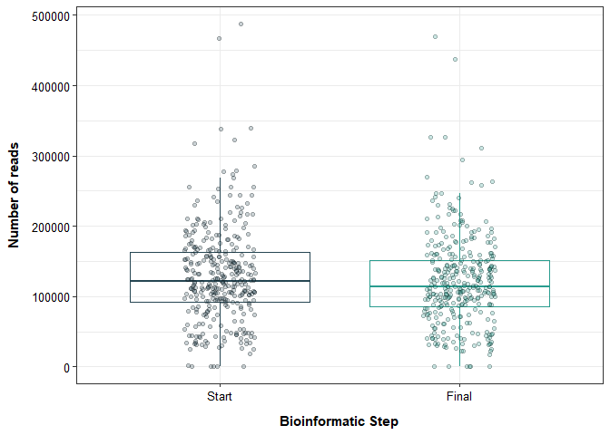
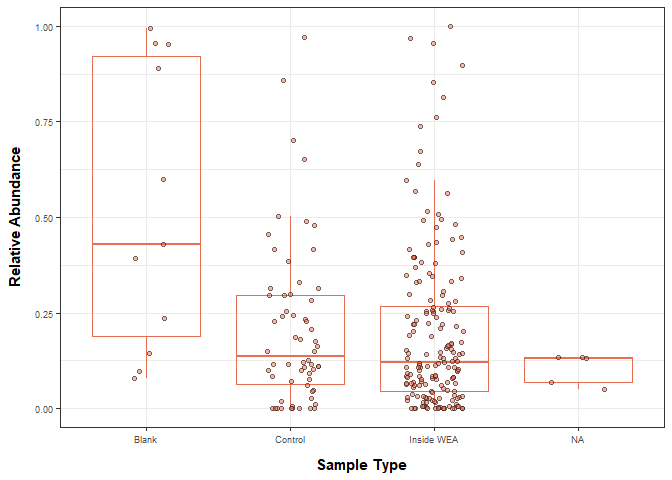
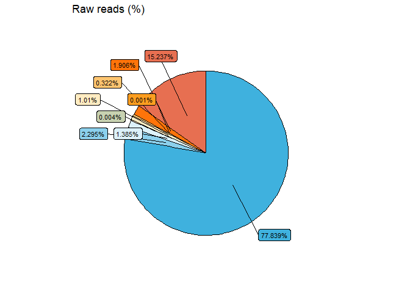
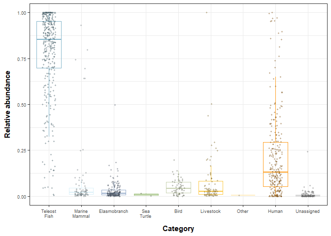
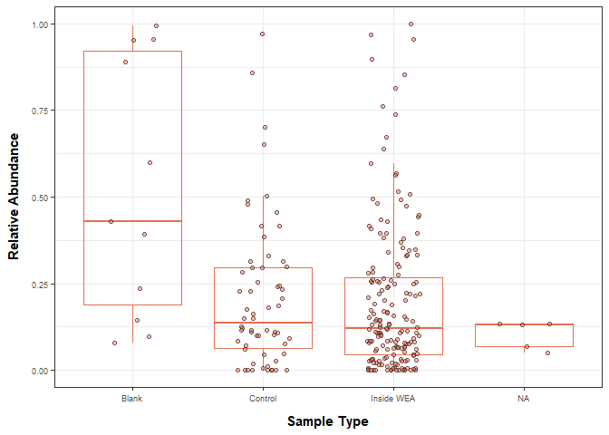
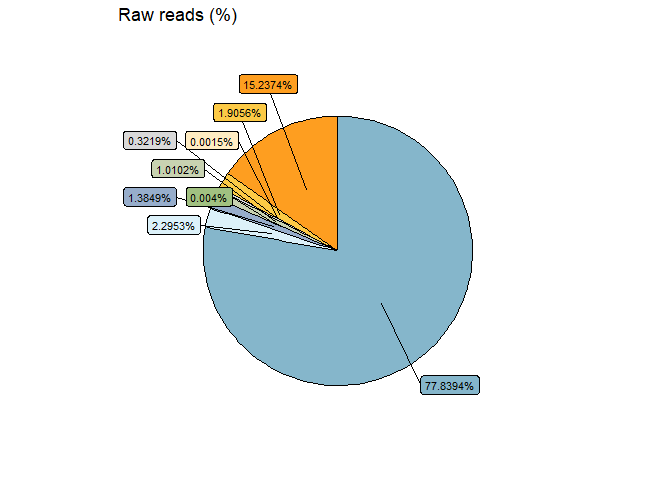

Metabarcoding data quality: eDNA metabarcoding base script
================

**.Rmd script**

This script evaluates your sequence quality and taxonomic assignment
quality. Figures produced in this script can go into supplemental data
for a manuscript.

## Load libraries

``` r
library(dplyr) # for data transformation
```

    ## 
    ## Attaching package: 'dplyr'

    ## The following objects are masked from 'package:stats':
    ## 
    ##     filter, lag

    ## The following objects are masked from 'package:base':
    ## 
    ##     intersect, setdiff, setequal, union

``` r
library(tidyverse) # for data transformation
```

    ## ── Attaching core tidyverse packages ──────────────────────── tidyverse 2.0.0 ──
    ## ✔ forcats   1.0.0     ✔ readr     2.1.5
    ## ✔ ggplot2   3.5.1     ✔ stringr   1.5.1
    ## ✔ lubridate 1.9.3     ✔ tibble    3.2.1
    ## ✔ purrr     1.0.2     ✔ tidyr     1.3.1

    ## ── Conflicts ────────────────────────────────────────── tidyverse_conflicts() ──
    ## ✖ dplyr::filter() masks stats::filter()
    ## ✖ dplyr::lag()    masks stats::lag()
    ## ℹ Use the conflicted package (<http://conflicted.r-lib.org/>) to force all conflicts to become errors

``` r
library(ggplot2) # for plotting
library(readxl) ## for reading in excel files
library(viridis)
```

    ## Loading required package: viridisLite

``` r
library(hrbrthemes)
library(ggrepel)
library(cowplot)
```

    ## 
    ## Attaching package: 'cowplot'
    ## 
    ## The following object is masked from 'package:lubridate':
    ## 
    ##     stamp

``` r
# removing scientific notation
## remove line or comment out if not desired 
options(scipen=999)
```

## Load data

``` r
### User edits:
### 1. Replace the 3 paths below: edit example_input to your project specific path 
### 2. Confirm your sampleIDs match between metadata, results df, and filtering stats output

filtering_stats <- read_tsv("example_input/overall_summary.tsv", show_col_types = FALSE) %>% dplyr::rename(sampleID = sample)

meta <- read_excel("example_input/metadata.xlsx")

results <- read_xlsx("example_output/Results_rawreads_long_format.xlsx") %>%
  ## calculate sum of reads 
  group_by(sampleID) %>%
  mutate(`Number of reads` = sum(reads)) %>%
  
  ## calculate relative abundance
  group_by(sampleID, Species_name) %>%
  mutate(`Relative Abundance` = reads/`Number of reads`) %>%
  
  ## factor the Category list 
  mutate(Category = factor(Category, levels = c("Human", "Livestock", "Other", "Unassigned", "Bird",
                                                "Sea Turtle", "Elasmobranch", "Marine Mammal", "Teleost Fish")))
                                                       
ASV_breakdown <- read_xlsx("example_output/ASV_breakdown.xlsx") %>%
  ## factor the Category list 
  mutate(Category = factor(Category, levels = c("Human", "Livestock", "Other", "Unassigned", "Bird",
                                                "Sea Turtle", "Elasmobranch", "Marine Mammal", "Teleost Fish")))
```

## Sequence data

### Data Transformation

No user edits.

``` r
df <- full_join(filtering_stats, meta, by = "sampleID") %>%
  # filtering out columns we don't need 
  dplyr::select(-cutadapt_reverse_complemented) %>%
  
  # removing percentage icon from cutadapt_passing_filters_percent
  mutate(cutadapt_passing_filters_percent = gsub("%", "", cutadapt_passing_filters_percent)) %>%
  
  # confirming that all columns of interest are numerical 
  mutate_at(vars(2:10), as.numeric) %>%
  
  # data transformation so all columns of interest are together 
  gather("measure", "value", 2:10)  
```

### Plotting

Suggested webpage to choose colors: <https://coolors.co/>

``` r
### User edits:
### 1. Change paths of output to desired folder (data/figures is suggested data structure)
### 2. Change x axis and color, size based on metadata desired 
### 3. Change custom colors and sizes if desired and number of colors and sizes based on metadata variable chosen 

df %>% 
  
  filter(!is.na(Month)) %>% 
  ## USER EDITS IN LINE BELOW 
  ggplot(., aes(x=Month, y=value)) + 
  
  ## adding points in jitter format 
  geom_jitter(width=0.15, alpha=0.5, fill="#0077b6", color='black', size=1, shape=21) + 
  
  ## option for additional boxplots if desired (uncomment to add)
  #geom_boxplot() +
  
  ## using facet_wrap to create grid based on variables and factor() to order them in custom format
  facet_wrap(~factor(measure, levels=c('cutadapt_total_processed', 'cutadapt_passing_filters', 
                                       'cutadapt_passing_filters_percent', 'DADA2_input',
                                 'filtered', 'denoisedF', 'denoisedR', 'merged', 'nonchim')), scales = "free") +
  
  ## graph asthetics 
  theme_bw() +
  ylab("Number of reads") + 

  theme(panel.background=element_rect(fill='white', colour='black'),
        strip.background=element_rect(fill='white', colour='black'),
        strip.text = element_text(size = 10, face="bold"),
        legend.position = "right",
        axis.text.y = element_text(size=7, color="grey30"),
        axis.text.x = element_text(angle=45, hjust=1),
        axis.title.y = element_text(margin = margin(t = 0, r = 10, b = 0, l = 0), size=11, face="bold"),
        axis.title.x = element_text(margin = margin(t = 10, r = 0, b = 0, l = 0), size=11, face="bold"))
```

    ## Warning: Removed 45 rows containing missing values or values outside the scale range
    ## (`geom_point()`).

<!-- -->

``` r
ggsave("example_output/Figures/SampleReport_FilteringStats.png", width = 11, height=9)
```

    ## Warning: Removed 45 rows containing missing values or values outside the scale range
    ## (`geom_point()`).

Condensed plot used in contract reporting.

``` r
### User edits:
### 1. Change paths of output to desired folder (data/figures is suggested data structure)
### 2. Change x axis and color, size based on metadata desired 
### 3. Change custom colors and sizes if desired and number of colors and sizes based on metadata variable chosen 

df %>% 
  subset(measure == "cutadapt_total_processed" | measure == "nonchim") %>%

  ## USER EDITS IN LINE BELOW 
  ggplot(., aes(x=measure, y=value)) + 
  
  ## adding points in jitter format 
  geom_boxplot(outlier.shape = NA, fill=NA, aes(color = measure)) +
  geom_jitter(width=0.15, shape=21, alpha=0.25, size=1.5, color = 'black', aes(fill = measure)) + 

  ## graph asthetics 
  theme_bw() +
  labs(
    y="Number of reads",
    x="Bioinformatic Step"
    ) + 
  
  ## USER EDITS IN MANUAL CODE BELOW 
  # scale_color_manual(values = c("red3", "lightblue", "purple2", "gold", "green4", "black")) +
  # scale_size_manual(values = c(21,17)) +
  scale_fill_manual(values = c("#264653", "#2a9d8f")) +
  scale_color_manual(values = c("#264653", "#2a9d8f")) +
  scale_x_discrete(labels = c("cutadapt_total_processed" = "Start", 
                              "nonchim" = "Final")) +
  
  theme(panel.background=element_rect(fill='white', colour='black'),
        strip.background=element_rect(fill='white', colour='black'),
        strip.text = element_text(size = 10, face="bold"),
        legend.position = "none",
        axis.text.y = element_text(size=10, color="black"),
        axis.text.x = element_text(size=10, color="black"),
        axis.title.y = element_text(margin = margin(t = 0, r = 10, b = 0, l = 0), size=11, face="bold"),
        axis.title.x = element_text(margin = margin(t = 10, r = 0, b = 0, l = 0), size=11, face="bold"))
```

    ## Warning: Removed 10 rows containing non-finite outside the scale range
    ## (`stat_boxplot()`).

    ## Warning: Removed 10 rows containing missing values or values outside the scale range
    ## (`geom_point()`).

<!-- -->

``` r
ggsave("example_output/Figures/SampleReport_FilteringStats_Condensed.png", width = 4, height=4)
```

    ## Warning: Removed 10 rows containing non-finite outside the scale range
    ## (`stat_boxplot()`).
    ## Removed 10 rows containing missing values or values outside the scale range
    ## (`geom_point()`).

## Plot taxonomy

### Data transformation

No user edits.

``` r
results_summary <- results %>% 
  group_by(Category) %>%
  reframe(sum_reads = sum(reads))

general_stats <- results %>% 
  group_by(Category) %>%
  reframe(sum_reads = sum(reads)) %>% 
  mutate(total = sum(sum_reads),
         percent = sum_reads/total*100) %>% dplyr::select(Category, percent) %>% distinct() %>%
  ## round to 2 decimal places 
  mutate(across(c('percent'), round, 3))
```

    ## Warning: There was 1 warning in `mutate()`.
    ## ℹ In argument: `across(c("percent"), round, 3)`.
    ## Caused by warning:
    ## ! The `...` argument of `across()` is deprecated as of dplyr 1.1.0.
    ## Supply arguments directly to `.fns` through an anonymous function instead.
    ## 
    ##   # Previously
    ##   across(a:b, mean, na.rm = TRUE)
    ## 
    ##   # Now
    ##   across(a:b, \(x) mean(x, na.rm = TRUE))

``` r
ASV_summary <- ASV_breakdown %>%
  group_by(Category) %>%
  reframe(count = n_distinct(ASV_ID))

species_summary <- results %>%
  group_by(Category) %>%
  reframe(count = n_distinct(Species_name))
```

### Relative abundance by category

``` r
fill_colors <- c("Human" = "#e76f51", 
                 "Livestock" = "#FF740A", 
                 "Other" = "#FE9E20", 
                 "Unassigned" = "#FFC571",
                 "Bird" = "#FFECC2",
                 "Sea Turtle" = "#C8D2B1", 
                 "Elasmobranch" = "#DCF1F9",
                 "Marine Mammal" ="#8CD0EC",
                 "Teleost Fish" = "#3FB1DE"
                 )

results %>% group_by(sampleID, Category) %>%
  reframe(group_sum = sum(reads),
         group_relab = group_sum/`Number of reads`
           ) %>% distinct() %>%
  
ggplot(., aes(y=group_relab, x=Category)) + 
  geom_boxplot(outlier.shape = NA, aes(color=Category), fill=NA) +
  geom_jitter(aes(fill=Category), width=0.2, shape=21, color='black', size = 0.75, alpha=0.35) +
    scale_color_manual(values = fill_colors) +
    scale_fill_manual(values = fill_colors) +
    labs(color = "Category") +
    scale_x_discrete(labels = scales::label_wrap(10)) +  
    theme_bw() + 
    xlab("Category") + ylab("Relative abundance") +
    theme(panel.background=element_rect(fill='white', colour='black'),
          legend.position = "none",
        axis.text.y = element_text(size=7, color="grey30"),
        axis.text.x = element_text(size=7), # angle=45, hjust=1
        axis.title.y = element_text(margin = margin(t = 0, r = 10, b = 0, l = 0), size=11, face="bold"),
        axis.title.x = element_text(margin = margin(t = 10, r = 0, b = 0, l = 0), size=11, face="bold"))
```

<!-- -->

``` r
ggsave("example_output/Figures/Categories_relative_abundance.png", width = 6.5, height = 4)
```

### Human specific reads by Sample Type

``` r
results %>% group_by(sampleID, Category) %>%
  reframe(group_sum = sum(reads),
         group_relab = group_sum/`Number of reads`
           ) %>% distinct() %>%
  
  ## subset to include Human and metadata 
  subset(Category == "Human") %>%
  left_join(., meta, by = "sampleID") %>%
  
  ggplot(., aes(x=SampleType, y=group_relab)) +
  geom_boxplot(outlier.shape=NA, fill=NA, color = "#e76f51") +
  geom_jitter(fill="#e76f51", shape=21, alpha=0.5, width=0.2) +
  labs(
    x = "Sample Type",
    y = "Relative Abundance"
  ) +
  theme_bw() +
  theme(panel.background=element_rect(fill='white', colour='black'),
          legend.position = "none",
        axis.text.y = element_text(size=7, color="grey30"),
        axis.text.x = element_text(size=7),
        axis.title.y = element_text(margin = margin(t = 0, r = 10, b = 0, l = 0), size=11, face="bold"),
        axis.title.x = element_text(margin = margin(t = 10, r = 0, b = 0, l = 0), size=11, face="bold"))
```

<!-- -->

``` r
ggsave("example_output/Figures/Human.png", width=4, height=3)
```

### Piechart

Reads Piechart. Used in contract report.

``` r
### User edits:
### 1. Change paths of output to desired folder (data/figures is suggested data structure)
### 2. Change scale brewer color if desired 

piechart <- general_stats %>%  
  mutate(csum = rev(cumsum(rev(percent))), 
         pos = percent/2 + lead(csum, 1),
         pos = if_else(is.na(pos), percent/2, pos))

unassigned_percent <- piechart %>% 
  filter(Category == "Unassigned") %>% 
  pull(percent)

piechart_reads <- general_stats %>% 
  ggplot(., aes(x="", y = percent, fill = Category)) +
  geom_col(color = "black", width=1.25) +
  geom_label_repel(data = piechart,
                   aes(y = pos, label = paste0(percent, "%")),
                   size = 3, nudge_x = 1, show.legend = FALSE) +
  coord_polar(theta = "y") +
  scale_fill_manual(values = fill_colors) +
  theme_bw() +
  # labs(
  #   x = NULL, y = NULL, fill = "Category", 
  #      caption = paste0("Unassigned reads = ", unassigned_percent, "%")
  # ) +
  theme(
    plot.background = element_rect(fill = "white", colour = NA),
    plot.margin = margin(t = 5, r = 5, b = 5, l = 5, unit = "pt"),
    legend.position = "none",
    panel.border = element_blank(),  # Remove panel border
    panel.grid = element_blank(),    # Remove grid lines
    axis.ticks = element_blank(),    # Remove axis ticks
    axis.text = element_blank(),     # Remove axis text
    axis.title = element_blank()     # Remove axis titles
      ) +
  ggtitle("Raw reads (%)") +
  xlab("") + ylab("") + labs(fill = "Category"); piechart_reads
```

<!-- -->

``` r
ggsave("example_output/Figures/Category_breakdown_percent_rawreads.png", width=4, height=3)
```

ASV Piechart (NOT used in contract report)

``` r
### User edits:
### 1. Change paths of output to desired folder (data/figures is suggested data structure)
### 2. Change scale brewer color if desired 

piechart_ASV <- ASV_summary %>%  
  mutate(csum = rev(cumsum(rev(count))), 
         pos = count/2 + lead(csum, 1),
         pos = if_else(is.na(pos), count/2, pos))

piechart_ASV <- ASV_summary %>% 
  ggplot(., aes(x="", y = count, fill = Category)) +
  geom_col(color = "black", width=1.25) +
  geom_label_repel(data = piechart_ASV,
                   aes(y = pos, label = paste0(count)),
                   size = 3, nudge_x = 1, show.legend = FALSE) +
  coord_polar(theta = "y") +
  scale_fill_manual(values = fill_colors) +
  theme_bw() +
  theme(
    plot.background = element_rect(fill = "white", colour = NA),
    plot.margin = margin(t = 5, r = 5, b = 5, l = 5, unit = "pt"),
    panel.border = element_blank(),  # Remove panel border
    panel.grid = element_blank(),    # Remove grid lines
    axis.ticks = element_blank(),    # Remove axis ticks
    axis.text = element_blank(),     # Remove axis text
    #legend.position = "none"
    axis.title = element_blank()     # Remove axis titles
      ) +
  ggtitle("Number of ASVs") +
  xlab("") + ylab("") + labs(fill = "Category"); piechart_ASV
```

<!-- -->

``` r
ggsave("example_output/Figures/Category_breakdown_ASVs.png", width=4, height=3)
```

Number of species pie chart. Used in contract report.

``` r
piechart_spp <- species_summary %>%  
  mutate(csum = rev(cumsum(rev(count))), 
         pos = count/2 + lead(csum, 1),
         pos = if_else(is.na(pos), count/2, pos))

piechart_species_plot <- species_summary %>% 
  ggplot(., aes(x="", y = count, fill = Category)) +
  geom_col(color = "black", width=1.25) +
  geom_label_repel(data = piechart_spp,
                   aes(y = pos, label = paste0(count)),
                   size = 3, nudge_x = 1, show.legend = FALSE) +
  coord_polar(theta = "y") +
  scale_fill_manual(values = fill_colors) +
  theme_bw() +
  theme(
    plot.background = element_rect(fill = "white", colour = NA),
    plot.margin = margin(t = 5, r = 5, b = 5, l = 5, unit = "pt"),
    panel.border = element_blank(),  # Remove panel border
    panel.grid = element_blank(),    # Remove grid lines
    axis.ticks = element_blank(),    # Remove axis ticks
    axis.text = element_blank(),     # Remove axis text
    axis.title = element_blank()     # Remove axis titles
  ) +
  ggtitle("Number of species") +
  xlab("") + ylab("") + labs(fill = "Category"); piechart_species_plot
```

<!-- -->

``` r
ggsave("example_output/Figures/Category_breakdown_species.png", width=4, height=3)
```

Plot together and export

``` r
plot_grid(piechart_reads, piechart_species_plot,
          ncol=2,
          align = "vh"
          )
```

<!-- -->

``` r
ggsave("example_output/Figures/Category_breakdown_contract.png", width=14, height=4)
```
