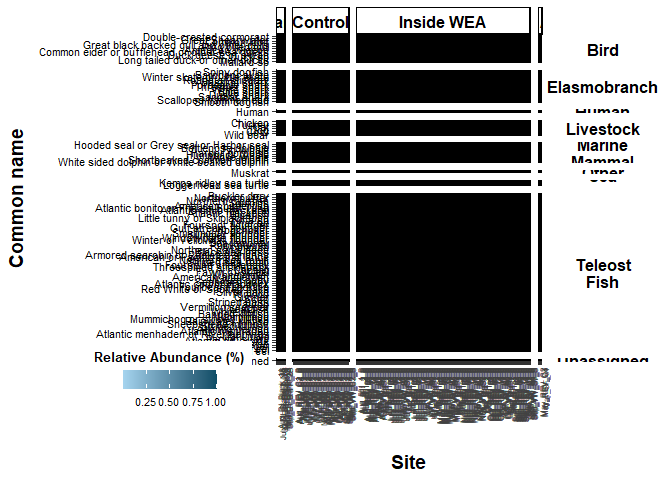
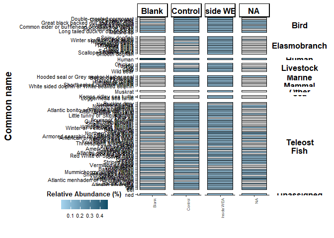
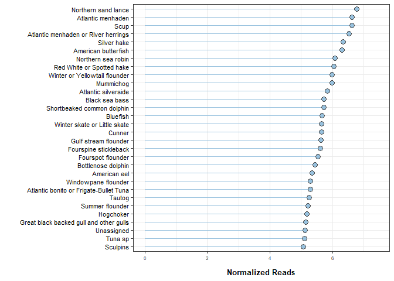

Relative Abundance Heatmaps: eDNA metabarcoding base script
================

**.Rmd script**

This script plots your relative abundance matrix as a heatmap. Figures
produced are potentially part of the main figures of your
manuscript/report.

## Load libraries

``` r
library(ggplot2) ## for plotting
library(dplyr) ## for data table manipulation
```

    ## 
    ## Attaching package: 'dplyr'

    ## The following objects are masked from 'package:stats':
    ## 
    ##     filter, lag

    ## The following objects are masked from 'package:base':
    ## 
    ##     intersect, setdiff, setequal, union

``` r
library(tidyr) ## for data table manipulation
library(readxl) ## for reading in excel files
library(stringr) ## for data transformation
library(strex) ## for data transformation
library(purrr) ## for data transformation
library(funrar) ## for make_relative()
library(tidyverse) ## for data transformation
```

    ## ── Attaching core tidyverse packages ──────────────────────── tidyverse 2.0.0 ──
    ## ✔ forcats   1.0.0     ✔ readr     2.1.5
    ## ✔ lubridate 1.9.3     ✔ tibble    3.2.1

    ## ── Conflicts ────────────────────────────────────────── tidyverse_conflicts() ──
    ## ✖ dplyr::filter() masks stats::filter()
    ## ✖ dplyr::lag()    masks stats::lag()
    ## ℹ Use the conflicted package (<http://conflicted.r-lib.org/>) to force all conflicts to become errors

``` r
library(naniar) ## replace_with_na_all function
library(ggh4x) ## for facet wrap options
```

    ## 
    ## Attaching package: 'ggh4x'
    ## 
    ## The following object is masked from 'package:ggplot2':
    ## 
    ##     guide_axis_logticks

``` r
library(tidytext)
library(forcats)
library(scales)
```

    ## 
    ## Attaching package: 'scales'
    ## 
    ## The following object is masked from 'package:readr':
    ## 
    ##     col_factor
    ## 
    ## The following object is masked from 'package:purrr':
    ## 
    ##     discard

## Load data

``` r
df <- read_xlsx("example_output/Results_relab_long.xlsx") %>%
  mutate(across(c(relab), ~ round(.x, 5)))

taxlevels <- read_excel(
  "C:/BoxDrive/Box/Science/Fisheries/Projects/eDNA/Metabarcoding Lab Resources/Reference Databases/GMGI_Vert_Ref.xlsx") %>% 
  dplyr::select("Species_name", "Kingdom", "Phylum", "Class", "Order", "Family", "Genus", "species") %>%
  distinct()

df_annotated <- df %>% left_join(., taxlevels, by = "Species_name")

## bringing in common names information for those not in our db
commonNames_annotated <- read_xlsx("example_output/Taxonomic_assignments/CommonNames_required_edited.xlsx")
  
# Loop through each row of the dataframe to add taxonomic level information from required edited worksheet 
for (i in commonNames_annotated$Species_name) {
  # Extract the current row (will do this for each ASV_ID in the choice df)
  current_row <- commonNames_annotated %>% subset(Species_name==i)
  
  # Apply filter based on the current row's condition
df_annotated <- df_annotated %>%
  mutate(across(c(Common_name, Category, Kingdom, Phylum, Class, Order, Family, Genus, species),
                ~case_when(Species_name == current_row$Species_name ~ current_row[[cur_column()]],
                           TRUE ~ .x)))
}

## tax list 
df_tax <- df_annotated %>% dplyr::select(Species_name, Kingdom:Genus) %>% distinct()
```

## Remove Categories

If you want to plot relative abundance without human, other, or
livestock categories. As FYI/warning, relative abundance is calculated
with these categories included. Relative abundance can also be thought
of as proportion of total reads, which is calculated from the total
reads for that sample.

``` r
df_filtered <- df_annotated %>% 
  filter(!Category == "Other" & !Category == "Livestock" & !Category == "Unassigned" & !Category == "Human") 

df_average <- df_annotated %>%
  group_by(SampleType, Species_name) %>%
  ### average relative abundance by sample Type
  mutate(avg_relab = mean(relab, na.rm=TRUE))
```

If targeted species heatmap is desired, replace df_annotated with
df_filtered in the heatmap code below. If so, remember to change the
file name exported.

## Plot

reverse label order: scale y discrete limits reverse limits=rev

<https://coolors.co/> (hit tools on the top right hand side)

``` r
## if subset of categories is desired, replace df below with df_filtered
df_annotated %>%
  
  ## replace zeros with NAs for plotting
  replace_with_na_all(condition = ~.x == 0.00000) %>%
  
  # Create a factor for Common_name ordered by Order within each Category
  group_by(Category) %>%
  mutate(Common_name = factor(Common_name, levels = unique(Common_name[order(Order, desc(Common_name))]))) %>%
  ungroup() %>%
  
  ## ggplot basic options (USER EDIT: X AND Y AXIS)
  ggplot(., aes(x = sampleID, y = Common_name)) +
  geom_tile(aes(fill = relab), color = "black") +
  
  ## x, y, and legend labels (USER EDITS IF DESIRED)
  ylab("Common name") +
  xlab("Site") +
  labs(fill = "Relative Abundance (%)") +
  
  ## color of the tile options; direction=1 will flip the low/high (USER EDITS IF DESIRED)
  scale_fill_gradient(na.value = "white", low = "lightskyblue2", high = "#0C4D66") + 
  
  ## facet grid with Category and project variables
  facet_grid2(Category ~ SampleType, 
              scales = "free", space = "free", 
              labeller = labeller(Category = label_wrap_gen(width = 10))) +
  
  ## graph theme options
  theme_classic() +
  theme(
    ## axis text 
    axis.text.x = element_text(angle = 90, size=6, color="grey25", hjust = 1),
    axis.text.y = element_text(colour = 'black', size = 8),
    
    ## legend text and title 
    legend.text = element_text(size = 8, color="black"),
    legend.title = element_text(margin = margin(t = 0, r = 0, b = 5, l = 0), size=10, color="black", face="bold"),
    legend.position = c(-0.4, -0.05), 
    legend.key.height = unit(5, 'mm'),
    legend.direction = "horizontal",
    legend.key.width = unit(5, 'mm'),
    legend.title.align = 0.5,
    legend.title.position = "top",
    
    ## axis titles 
    axis.title.y = element_text(margin = margin(t = 0, r = 10, b = 0, l = 0), size=14, face="bold"),
    axis.title.x = element_text(margin = margin(t = 10, r = 0, b = 0, l = 0), size=14, face="bold"),
        
    ## facet wrap labels
    strip.text.x = element_text(color = "black", face = "bold", size = 12),
    strip.text.y = element_text(color = "black", face = "bold", size = 12, angle=0),
    strip.background.y = element_blank(),
    strip.clip = "off"
    )
```

    ## Warning: The `legend.title.align` argument of `theme()` is deprecated as of ggplot2
    ## 3.5.0.
    ## ℹ Please use theme(legend.title = element_text(hjust)) instead.
    ## This warning is displayed once every 8 hours.
    ## Call `lifecycle::last_lifecycle_warnings()` to see where this warning was
    ## generated.

    ## Warning: A numeric `legend.position` argument in `theme()` was deprecated in ggplot2
    ## 3.5.0.
    ## ℹ Please use the `legend.position.inside` argument of `theme()` instead.
    ## This warning is displayed once every 8 hours.
    ## Call `lifecycle::last_lifecycle_warnings()` to see where this warning was
    ## generated.

<!-- -->

``` r
## USER EDITS WIDTH AND HEIGHT TO DESIRED   
ggsave("example_output/Figures/Relative_abundance.png", width = 22, height = 14)  
```

Heatmap plot by sample type

``` r
df_average %>%
  dplyr::select(Species_name, Common_name, Category, SampleType, Kingdom:avg_relab) %>%
  
  ## replace zeros with NAs for plotting
  replace_with_na_all(condition = ~.x == 0.00000) %>%
  
  # Create a factor for Common_name ordered by Order within each Category
  group_by(Category) %>%
  mutate(Common_name = factor(Common_name, levels = unique(Common_name[order(Order, desc(Common_name))]))) %>%
  ungroup() %>%
  
    ## ggplot basic options (USER EDIT: X AND Y AXIS)
  ggplot(., aes(x = SampleType, y = Common_name)) +
  geom_tile(aes(fill = avg_relab), color = "black") +
  
  ## x, y, and legend labels (USER EDITS IF DESIRED)
  ylab("Common name") +
  xlab("") +
  labs(fill = "Relative Abundance (%)") +
  
  ## color of the tile options; direction=1 will flip the low/high (USER EDITS IF DESIRED)
  scale_fill_gradient(na.value = "white", low = "lightskyblue2", high = "#0C4D66") + 
  
  ## facet grid with Category and project variables
  facet_grid2(Category ~ SampleType, 
              scales = "free", space = "free", 
              labeller = labeller(Category = label_wrap_gen(width = 10))) +
  
  ## graph theme options
  theme_classic() +
  theme(
    ## axis text 
    axis.text.x = element_text(angle = 90, size=6, color="grey25", hjust = 1),
    axis.text.y = element_text(colour = 'black', size = 8),
    
    ## legend text and title 
    legend.text = element_text(size = 8, color="black"),
    legend.title = element_text(margin = margin(t = 0, r = 0, b = 5, l = 0), size=10, color="black", face="bold"),
    legend.position = c(-0.4, -0.05), 
    legend.key.height = unit(5, 'mm'),
    legend.direction = "horizontal",
    legend.key.width = unit(5, 'mm'),
    legend.title.align = 0.5,
    legend.title.position = "top",
    
    ## axis titles 
    axis.title.y = element_text(margin = margin(t = 0, r = 10, b = 0, l = 0), size=14, face="bold"),
    axis.title.x = element_text(margin = margin(t = 10, r = 0, b = 0, l = 0), size=14, face="bold"),
        
    ## facet wrap labels
    strip.text.x = element_text(color = "black", face = "bold", size = 12),
    strip.text.y = element_text(color = "black", face = "bold", size = 12, angle=0),
    strip.background.y = element_blank(),
    strip.clip = "off"
    )
```

<!-- -->

``` r
ggsave("example_output/Figures/Relative_abundance_sampletype.png", width = 7, height = 14) 
```

## Top Species List visual

``` r
top_list <- read_xlsx("example_output/Results_rawreads_long.xlsx") %>%
  filter(!Category == "Other" & !Category == "Livestock" & !Category == "unassigned" & !Category == "Human") %>%
  group_by(Species_name, Common_name) %>%
  summarise(total = sum(reads),
            log = log10(total),
            total_M = total/1000000) %>% 
  arrange(desc(total)) %>%
  head(30) 
```

    ## `summarise()` has grouped output by 'Species_name'. You can override using the
    ## `.groups` argument.

``` r
ggplot(top_list, aes(x = fct_reorder(Common_name, log), y = log)) +
  geom_segment(aes(xend = Common_name, yend = 0), color = "#97C1DE") +  # Lollipop stick
  geom_point(size = 3, shape=21, color='grey30', fill = "#97C1DE") +  # Lollipop head
  coord_flip() +  # Flip coordinates for horizontal lollipop chart
  labs(
       x = "",
       y = "Normalized Reads") +
  theme_bw() +
  theme(axis.text.y = element_text(size = 8, color='black'), #, face="italic"
        axis.text.x = element_text(size = 6),
        axis.title.y = element_text(margin = margin(t = 0, r = 10, b = 0, l = 0), size=10, face="bold"),
        axis.title.x = element_text(margin = margin(t = 10, r = 0, b = 0, l = 0), size=10, face="bold"),
        axis.text.x.top = element_text(size = 8, color='black', face="italic", angle = 45, hjust = 0)) +
  scale_y_continuous(
    labels = comma,
    limits = c(0, max(top_list$log) + (max(top_list$log)*0.1))  # Set the upper limit to max value + 10%
  )
```

<!-- -->

``` r
ggsave("example_output/Figures/Top_species_log.png", width=3.5, height=6)
```

## Bubble plot

``` r
raw_df <- read_xlsx("example_output/Results_rawreads_long.xlsx") %>%
  group_by(Species_name, Common_name, Category) %>%
  reframe(sum = sum(reads)/1000000,
          xaxis = "x") %>%
  left_join(., df_tax, by = "Species_name") %>%
  mutate(Target_group = case_when(
    Category == "Human" ~ "Nontarget",
    Category == "Other" ~ "Nontarget",
    Category == "Unassigned" ~ "Nontarget",
    Category == "Livestock" ~ "Nontarget",
    Category == "Bird" ~ "Target1",
    Category == "Elasmobranch" ~ "Target1",
    Category == "Marine Mammal" ~ "Target1",
    Category == "Sea Turtle" ~ "Target1",
    Category == "Teleost Fish" ~ "Target2"
  )) %>% filter(!Target_group == "Nontarget") 


raw_df %>% 
  filter(!Target_group == "Nontarget") %>%
  # Create a factor for Common_name ordered by Order within each Category
  group_by(Category) %>%
  mutate(Common_name = factor(Common_name, levels = unique(Common_name[order(Order, desc(Common_name))]))) %>%
  ungroup() %>%
  
  ggplot(., aes(x=xaxis, y=Common_name)) + 
  
  geom_point(aes(size=sum, fill=sum), color = 'black', shape=21) +
  scale_fill_gradient(na.value = "white", low = "lightskyblue2", high = "#0C4D66") +

  facet_grid2(Category ~ ., scales = "free", space = "free") +
  
  theme_bw() +
  labs(
    x="",
    y="",
    fill = "Reads (M)",
    size = "Reads (M)"
  ) +
  
  theme(
    axis.text.y = element_text(size = 8, color = 'black'),
    axis.text.x = element_blank(),
    axis.title.y = element_text(margin = margin(t = 0, r = 10, b = 0, l = 0), size=12, face="bold"),
    axis.title.x = element_text(margin = margin(t = 10, r = 0, b = 0, l = 0), size=12, face="bold"),
    ## facet wrap labels
    strip.text.x = element_text(color = "black", face = "bold", size = 12),
    #strip.text.y = element_text(color = "black", face = "bold", size = 12, angle=0),
    strip.text.y = element_blank(),
    strip.background.y = element_blank(),
    strip.clip = "off",
    # Combine legends
    legend.position = "right",
    legend.box = "vertical"
  ) +
  guides(
    fill = "none",
    size = guide_legend(order = 2, reverse = TRUE,
                        override.aes = list(fill = scales::seq_gradient_pal("#0C4D66", "lightskyblue2")
                                            (seq(0, 1, length.out = 5))))
  )
```

<!-- -->

``` r
ggsave("example_output/Figures/Species_bubbleplot.png", width=4.5, height=16)
```

Setting up plot for loop

``` r
# # Get unique categories
# categories <- unique(raw_df$Category)
#   
# # Set the fixed size range
# size_range <- c(0, max(raw_df$sum))
# 
# # Create color palette
# color_palette <- scales::seq_gradient_pal("#0C4D66", "lightskyblue2")(seq(0, 1, length.out = 6))
# 
# # Create a list to store the plots
# plot_list <- list()
# 
# # Define custom widths and heights for each category
# dimensions <- data.frame(
#   Category = categories,
#   Width = c(4, 4, 4, 4, 4),  # Example widths for each category
#   Height = c(7, 7, 7, 7, 7)   # Example heights for each category
# )
# 
# aspect_ratio <- 2
```

For loop to create each plot

``` r
# # Loop through each category
# for (cat in categories) {
#   
#   raw_df_filtered <- raw_df %>% 
#     filter(Category == cat) %>% #!Target_group == "Nontarget", 
#     # Create a factor for Common_name ordered by Order within each Category
#     mutate(Common_name = factor(Common_name, levels = unique(Common_name[order(Order, desc(Common_name))])))
# 
#   plot <- raw_df_filtered %>%
#     ggplot(aes(x=xaxis, y=Common_name)) + 
#     geom_point(aes(size=sum, fill=sum), color = 'black', shape=21) +
#     scale_size_continuous(range = c(1, 10), limits = size_range) +
#     scale_fill_gradient(na.value = "white", low = "lightskyblue2", high = "#0C4D66", limits = size_range) +
#     theme_bw() +
#     labs(
#       title = cat,
#       x="",
#       y="",
#       fill = "Reads (M)",
#       size = "Reads (M)"
#     ) +
#     theme(
#       axis.text.y = element_text(size = 8, color = 'black'),
#       axis.text.x = element_blank(),
#       axis.title.y = element_text(margin = margin(t = 0, r = 10, b = 0, l = 0), size=12, face="bold"),
#       axis.title.x = element_text(margin = margin(t = 10, r = 0, b = 0, l = 0), size=12, face="bold"),
#       plot.title = element_text(hjust = 0.5, face = "bold", size = 14),
#       # Combine legends
#       legend.position = "right",
#       legend.box = "vertical"
#     ) +
#     guides(
#       fill = "none",
#       size = guide_legend(order = 2, reverse = TRUE,
#                           override.aes = list(fill = color_palette))
#     ) #+ coord_fixed(ratio=aspect_ratio)
#   
#   # Store the plot in the list
#   plot_list[[cat]] <- plot
#   
# # Get the corresponding width and height
#     width <- dimensions$Width[dimensions$Category == cat]
#     height <- dimensions$Height[dimensions$Category == cat]
# 
#   # Save the plot with specified dimensions
#   ggsave(filename = paste0("example_output/Figures/Bubbleplot/Bubbleplot_", cat, ".png"), 
#          plot = plot, 
#          width = width, 
#          height = height,
#          units = "in", 
#          dpi = 300)
# }
```
