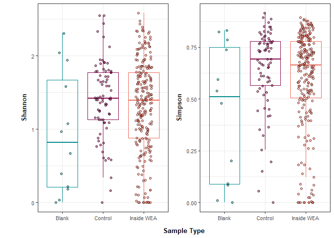
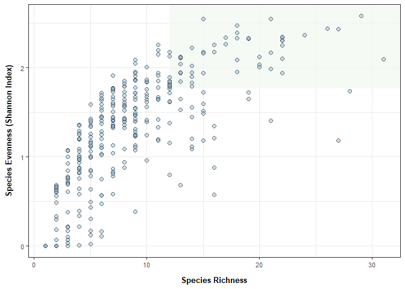
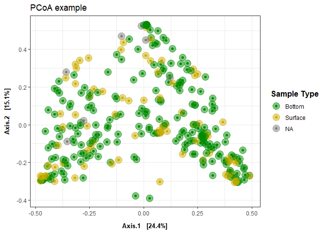
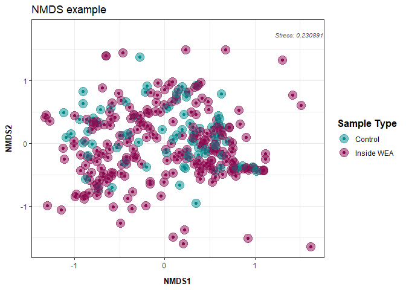

Phyloseq Diversity Metrics: eDNA metabarcoding base script
================

This script analyzes your relative abundance matrix to assess alpha and
beta diversity. Figures produced are potentially part of the main
figures of your manuscript/report.

# Load libraries

``` r
library(ggplot2) ## for plotting
library(tidyverse) ## for data manipulation 
```

    ## ── Attaching core tidyverse packages ──────────────────────── tidyverse 2.0.0 ──
    ## ✔ dplyr     1.1.4     ✔ readr     2.1.5
    ## ✔ forcats   1.0.0     ✔ stringr   1.5.1
    ## ✔ lubridate 1.9.3     ✔ tibble    3.2.1
    ## ✔ purrr     1.0.2     ✔ tidyr     1.3.1
    ## ── Conflicts ────────────────────────────────────────── tidyverse_conflicts() ──
    ## ✖ dplyr::filter() masks stats::filter()
    ## ✖ dplyr::lag()    masks stats::lag()
    ## ℹ Use the conflicted package (<http://conflicted.r-lib.org/>) to force all conflicts to become errors

``` r
library(phyloseq)
library(knitr)
library(readxl)
library(writexl)
library(cowplot)
```

    ## 
    ## Attaching package: 'cowplot'
    ## 
    ## The following object is masked from 'package:lubridate':
    ## 
    ##     stamp

``` r
## for stats
library(pairwiseAdonis)
```

    ## Loading required package: vegan
    ## Loading required package: permute
    ## Loading required package: lattice
    ## This is vegan 2.6-8
    ## Loading required package: cluster

``` r
library(lme4) ## for stats
```

    ## Loading required package: Matrix
    ## 
    ## Attaching package: 'Matrix'
    ## 
    ## The following objects are masked from 'package:tidyr':
    ## 
    ##     expand, pack, unpack

``` r
library(car) ## for stats
```

    ## Loading required package: carData
    ## 
    ## Attaching package: 'car'
    ## 
    ## The following object is masked from 'package:dplyr':
    ## 
    ##     recode
    ## 
    ## The following object is masked from 'package:purrr':
    ## 
    ##     some

``` r
library(stats) ## for stats
library(vegan)
library("microbiome") ## for alpha diversity functions
```

    ## 
    ## microbiome R package (microbiome.github.com)
    ##     
    ## 
    ## 
    ##  Copyright (C) 2011-2022 Leo Lahti, 
    ##     Sudarshan Shetty et al. <microbiome.github.io>
    ## 
    ## 
    ## Attaching package: 'microbiome'
    ## 
    ## The following object is masked from 'package:vegan':
    ## 
    ##     diversity
    ## 
    ## The following object is masked from 'package:ggplot2':
    ## 
    ##     alpha
    ## 
    ## The following object is masked from 'package:base':
    ## 
    ##     transform

``` r
## set seed
set.seed(1234)
```

# Load data

Before continuing with analyses, decide on what data you’re going to use
an input. Relative abundance, raw reads, rarefied counts (can be done in
phyloseq), variance stabilizing transformation (vst) from DESeq2? The
input will impact your interpretation and thus is important to decide
**before** conducting any stats to avoid bias towards a particular
result.

On the Fisheries team, we have traditionally used relative abundance and
the following code uses that dataset.

### Relative Abundance data

``` r
# Option 1: Change global options (affects all subsequent operations)
## Convert scientific notation to regular numbers
options(scipen = 999)

## Relative abundance matrix 
df <- read_xlsx("example_output/Results_2_relative_abundance_matrix.xlsx") %>%
  ## removing common_name and category for now 
  dplyr::select(-Common_name, -Category) %>%
  
  ## Remove columns with NA values
  dplyr::select(where(~!any(is.na(.)))) %>%
  
  ## making species_name rownames instead of column 
  column_to_rownames(var = "Species_name") %>%
  
  # remove columns that sum to 0
  select(where(~sum(., na.rm = TRUE) != 0))
```

### Metadata

``` r
meta <- read_xlsx("example_input/metadata.xlsx") %>%
  
  ## rownames are also needed in phyloseq meta table
  mutate(sampleID2=sampleID) %>% column_to_rownames(var = "sampleID2")
```

# Create phyloseq object

``` r
## Create ASV (OTU) table and meta table 
otu <- otu_table(df, taxa_are_rows = T)
meta_phyloseq <- sample_data(meta)

## Merge metadata and OTU table into one phyloseq "object"
phylo_obj <- merge_phyloseq(otu, meta_phyloseq)

## view phyloseq obj 
## expected output = otu_table() with taxa and sample numbers and sample_data() with the sample and column numbers
print(phylo_obj)
```

    ## phyloseq-class experiment-level object
    ## otu_table()   OTU Table:         [ 107 taxa and 328 samples ]
    ## sample_data() Sample Data:       [ 328 samples by 10 sample variables ]

``` r
# Ensure that your OTU table doesn't contain any NA or negative values (output should be FALSE)
any(is.na(otu_table(phylo_obj)))
```

    ## [1] FALSE

``` r
any(otu_table(phylo_obj) < 0)
```

    ## [1] FALSE

### Subsetting phyloseq object

Optional if you’d like to break your data up by a certain variable
(surface water, bottom water). If desired, uncomment the code chunk
below.

``` r
# surface <- subset_samples(phylo_obj, SampleType == "Surface Water")
# bottom <- subset_samples(phylo_obj, SampleType == "Bottom Water") 
```

# Alpha Diversity

Comparing the species diversity (shannon index or species richness) at
each site.

## Calculating Shannon Index and Species Richness

The alpha function in the microbiome package calculates several alpha
diversity indices. The most relevant are likely observed (species
richness) and diversity_shannon (shannon index).

<https://microbiome.github.io/tutorials/Alphadiversity.html>

Or use plot_richness function from:  
<https://rstudio-pubs-static.s3.amazonaws.com/1071936_6115f873acbc4dc4a30b1380cc3885fb.html>

``` r
fill_col = c("cyan4", "deeppink4", "#ed6a5a")

## Calculate
alpha_div <- estimate_richness(phylo_obj, measures = c("Shannon", "Simpson")) %>%
  rownames_to_column(var = "sampleID") %>% left_join(., meta, by = "sampleID") 

alpha_div %>%
  gather("measurement", "value", Shannon:Simpson) %>%
  ggplot(., aes(x=SampleType, y=value)) +
  geom_boxplot(aes(color = SampleType), fill=NA, outlier.shape=NA, show.legend = FALSE) +
  geom_jitter(width=0.2, shape=21, aes(fill = SampleType), color = 'black', alpha=0.5) +
  facet_wrap(~measurement, scales = "free_y", strip.position = "left") +
  ## labels
  labs(x="Sample Type", y="", fill = "Sample Type") +
  
  scale_fill_manual(values = fill_col) +
  scale_color_manual(values = fill_col) +

  ## theme options
  theme_bw() + 
  theme(panel.background=element_blank(),
        strip.background=element_blank(),
        strip.text = element_text(size = 10, face="bold"),
        legend.position = "none",
        strip.clip = 'off',
        strip.placement = "outside",
        axis.text.y = element_text(size=8, color="grey30"),
        axis.text.x = element_text(size=8, color="grey30"),
        axis.title.y = element_text(margin = margin(t = 0, r = 10, b = 0, l = 0), size=10, face="bold"),
        axis.title.x = element_text(margin = margin(t = 10, r = 0, b = 0, l = 0), size=10, face="bold"))
```

<!-- -->

``` r
ggsave("example_output/Figures/alpha_diversity.png", width = 6, height = 4)
```

Richness vs. Shannon per sample used in contract report

``` r
## Species Richness
biodiv_df <- df %>% 
  rownames_to_column(var = "Species_name") %>% 
  gather("sampleID", "relab", 2:last_col()) %>% 
  group_by(sampleID) %>%
  summarize(richness = sum(relab > 0)) %>%

## Species Evenness ~ Shannon
left_join(., alpha_div %>% dplyr::select(sampleID, Shannon), by = "sampleID") 

## Exporting data 
biodiv_df %>% dplyr::rename(Richness = richness) %>% left_join(., meta, by = "sampleID") %>%
  write_xlsx("example_output/Biodiversity.xlsx")

## plotting
biodiv_df %>%
  ggplot(., aes(x=richness, y=Shannon)) + 
  
  annotate("rect", xmin=quantile(biodiv_df$richness, 0.75), xmax=Inf,
             ymin=quantile(biodiv_df$Shannon, 0.75, na.rm = TRUE), ymax=Inf,
             alpha=0.2, fill="#058C42") +

  geom_point(fill = "#97C1DE", color='black', shape=21, alpha=0.5, size=2) + 
  
  labs(
    x = "Sample Richness",
    y = "Sample Evenness (Shannon Index)"
  ) +
  theme_bw() +
  theme(
    axis.text.y = element_text(size=8, color="grey30"),
        axis.text.x = element_text(size=8, color="grey30"),
        axis.title.y = element_text(margin = margin(t = 0, r = 10, b = 0, l = 0), size=10, face="bold"),
        axis.title.x = element_text(margin = margin(t = 10, r = 0, b = 0, l = 0), size=10, face="bold")
  )
```

    ## Warning: Removed 5 rows containing missing values or values outside the scale range
    ## (`geom_point()`).

<!-- -->

``` r
ggsave("example_output/Figures/biodiversity.png", width = 5.5, height = 5)
```

    ## Warning: Removed 5 rows containing missing values or values outside the scale range
    ## (`geom_point()`).

## Statistics

Test: T-test or ANOVA - Type I, II, and III:  
- \* indicates an interaction (SampleType\*Month). Usually we are
interested in the interaction of our factors.  
- + indicates an additive effect (SampleType + Month)

T-test to be used when only two groups to compare and ANOVA to be used
with 3+ groups. Al

non-parametric Kolmogorov-Smirnov test for two-group comparisons when
there are no relevant covariates

``` r
## Create model 
aov <- aov(Shannon ~ SampleType, data = alpha_div)

## ANOVA test on above model
Anova(aov, type = "III")
```

    ## Anova Table (Type III tests)
    ## 
    ## Response: Shannon
    ##              Sum Sq  Df F value       Pr(>F)    
    ## (Intercept)  10.880   1 28.9137 0.0000001449 ***
    ## SampleType    2.302   2  3.0595      0.04827 *  
    ## Residuals   122.294 325                         
    ## ---
    ## Signif. codes:  0 '***' 0.001 '**' 0.01 '*' 0.05 '.' 0.1 ' ' 1

Test: If 3+ groups, Tukey Post Hoc Comparisons

``` r
TukeyHSD(aov)
```

    ##   Tukey multiple comparisons of means
    ##     95% family-wise confidence level
    ## 
    ## Fit: aov(formula = Shannon ~ SampleType, data = alpha_div)
    ## 
    ## $SampleType
    ##                           diff         lwr        upr     p adj
    ## Control-Blank       0.46237370  0.01372728 0.91102012 0.0416634
    ## Inside WEA-Blank    0.36259559 -0.06463695 0.78982812 0.1142372
    ## Inside WEA-Control -0.09977811 -0.28988218 0.09032596 0.4329459

# Beta Diversity

Comparing the community assemblages between sites/groups.

Resources (Read before continuing):  
- <https://ourcodingclub.github.io/tutorials/ordination/> -
<https://uw.pressbooks.pub/appliedmultivariatestatistics/chapter/comparison-of-ordination-techniques/>

Common options:  
- Principal Components Analysis (PCA): Euclidean distance measure  
- Principal Coordinates Analysis (PCoA): Dissimilarity distance based  
- Non-metric MultiDimensional Scaling (NMDS): Dissimilarity distance
based

PCoA and NMDS handle zero’s in community matrices much better than PCA.
For metabarcoding data, usually PCoA and NMDS are more appropriate. The
differences between PCoA and NMDS are minor compared to difference
between PCA. NMDS is iterative and used a different ordering method (see
resource links above for more info).

NMDS requires evaluation of the output ‘stress value’: This value tells
you how well the model fit your data. This is helpful to include on your
NMDS plot in reports/manuscripts/presentations.

Stress (0-1 scale) Interpretation `< 0.05` = Excellent representation
with no prospect of misinterpretation `< 0.10` = Good ordination with no
real disk of drawing false inferences `< 0.20` = Can be useful but has
potential to mislead. In particular, shouldn’t place too much reliance
on the details `> 0.20` = Could be dangerous to interpret `> 0.35` =
Samples placed essentially at random; little relation to original ranked
distances

If your stress value is \>0.2, do not include in analyses and try PCoA
instead.

## Calculating dissimilarity matrix

``` r
## Bray Curtis Dissimilarity Matrix (used in statistics)
bray_df <- phyloseq::distance(phylo_obj, method = "bray")

## Sample information
sample_df <- data.frame(sample_data(phylo_obj))
```

## Plotting

### PCoA

<https://www.rdocumentation.org/packages/phyloseq/versions/1.16.2/topics/ordinate>

``` r
## Conduct PCoA 
pcoa <- ordinate(physeq = phylo_obj, method = "PCoA", distance = "bray")

## Plotting
plot_ordination(phylo_obj, pcoa, 
                
                ## USER EDITS shape, color, alpha, fill, etc. as desired based on project metadata
                color = "Depth") +
  
  ## Point and point aesthetics
  geom_point(aes(color = Depth), alpha = .5, size = 5) +
  scale_color_manual(values = c("green4", "gold3")) +

  ## Labels: USER EDITS as desired
  labs(color = "Sample Type") +
  ggtitle("PCoA example") +
  
  ## Theme: USER EDITS as desired
  theme_bw() +
  theme(
    legend.title = element_text(face = "bold", size=12),
    legend.position = "right",
    axis.title.y = element_text(margin = margin(t = 0, r = 10, b = 0, l = 0), size=10, face="bold"),
    axis.title.x = element_text(margin = margin(t = 10, r = 0, b = 0, l = 0), size=10, face="bold"),
  ) 
```

<!-- -->

``` r
## USER EDITS WIDTH AND HEIGHT TO DESIRED   
ggsave("example_output/Figures/PCoA_phyloseq.png", width = 8, height = 6)
```

### NMDS

``` r
## Calculating NMDS 
## filtering for the sake of example visual
phylo_obj_filtered <- prune_samples(sample_data(phylo_obj)$SampleType != "Blank", phylo_obj)

NMDS <- ordinate(physeq = phylo_obj_filtered, method = "NMDS", distance = "bray")
```

    ## Run 0 stress 0.2324997 
    ## Run 1 stress 0.2399498 
    ## Run 2 stress 0.2363517 
    ## Run 3 stress 0.2410485 
    ## Run 4 stress 0.2466303 
    ## Run 5 stress 0.2422236 
    ## Run 6 stress 0.2435588 
    ## Run 7 stress 0.2445893 
    ## Run 8 stress 0.2359513 
    ## Run 9 stress 0.2366502 
    ## Run 10 stress 0.2433675 
    ## Run 11 stress 0.2533385 
    ## Run 12 stress 0.2439828 
    ## Run 13 stress 0.2438916 
    ## Run 14 stress 0.2402618 
    ## Run 15 stress 0.246462 
    ## Run 16 stress 0.2315938 
    ## ... New best solution
    ## ... Procrustes: rmse 0.02792967  max resid 0.1792405 
    ## Run 17 stress 0.2359704 
    ## Run 18 stress 0.2448772 
    ## Run 19 stress 0.2472408 
    ## Run 20 stress 0.2375073 
    ## *** Best solution was not repeated -- monoMDS stopping criteria:
    ##      1: no. of iterations >= maxit
    ##     19: stress ratio > sratmax

``` r
## Plotting
plot_ordination(phylo_obj_filtered, NMDS, 
                
                ## USER EDITS shape, color, alpha, fill, etc. as desired based on project metadata
                color = "SampleType") +
  
  ## Point and point aesthetics
  geom_point(aes(color = SampleType), alpha = .5, size = 5) +
  scale_color_manual(values = fill_col) +

  ## Labels: USER EDITS as desired
  labs(color = "Sample Type") +
  ggtitle("NMDS example") +
  
  ## adding stress value to plot (user edits x and y to desired location)
  annotate(geom = "label", x = 1.2, y = 1.8, 
           label = sprintf("Stress: %.6f", NMDS$stress), hjust = 0, vjust = 1, 
           label.size = NA, fontface = "italic", color = "grey30", size = 2.75, fill="white") +
  
  ## Theme: USER EDITS as desired
  theme_bw() +
  theme(
    legend.title = element_text(face = "bold", size=12),
    legend.position = "right",
    axis.title.y = element_text(margin = margin(t = 0, r = 10, b = 0, l = 0), size=10, face="bold"),
    axis.title.x = element_text(margin = margin(t = 10, r = 0, b = 0, l = 0), size=10, face="bold"),
  ) 
```

<!-- -->

``` r
## USER EDITS WIDTH AND HEIGHT TO DESIRED   
ggsave("example_output/Figures/NMDS_phyloseq.png", width = 8, height = 6)
```

## Statistics

Test: PERMANOVA - \* indicates an interaction (SampleType\*Month).
Usually we are interested in the interaction of our factors.  
- + indicates an additive effect (SampleType + Month)

The output will tell you which factors significantly impact the
community assemblage (matrix).

``` r
adonis2(bray_df ~ SampleType, data = sample_df, permutations = 99)
```

    ## Permutation test for adonis under reduced model
    ## Permutation: free
    ## Number of permutations: 99
    ## 
    ## adonis2(formula = bray_df ~ SampleType, data = sample_df, permutations = 99)
    ##           Df SumOfSqs      R2     F Pr(>F)   
    ## Model      2    1.973 0.01778 2.941   0.01 **
    ## Residual 325  109.017 0.98222                
    ## Total    327  110.990 1.00000                
    ## ---
    ## Signif. codes:  0 '***' 0.001 '**' 0.01 '*' 0.05 '.' 0.1 ' ' 1

Additional test: Pairwise PERMANOVA

The output will tell you which specific variable within each factor is
driving the significant effects.

``` r
pairwise.adonis2(bray_df ~ SampleType, data = sample_df)
```

    ## $parent_call
    ## [1] "bray_df ~ SampleType , strata = Null , permutations 999"
    ## 
    ## $`Inside WEA_vs_Blank`
    ##           Df SumOfSqs      R2      F Pr(>F)    
    ## Model      1    1.408 0.01639 4.1647  0.001 ***
    ## Residual 250   84.541 0.98361                  
    ## Total    251   85.949 1.00000                  
    ## ---
    ## Signif. codes:  0 '***' 0.001 '**' 0.01 '*' 0.05 '.' 0.1 ' ' 1
    ## 
    ## $`Inside WEA_vs_Control`
    ##           Df SumOfSqs      R2      F Pr(>F)  
    ## Model      1    0.606 0.00568 1.7942  0.069 .
    ## Residual 314  106.037 0.99432                
    ## Total    315  106.643 1.00000                
    ## ---
    ## Signif. codes:  0 '***' 0.001 '**' 0.01 '*' 0.05 '.' 0.1 ' ' 1
    ## 
    ## $Blank_vs_Control
    ##          Df SumOfSqs      R2      F Pr(>F)   
    ## Model     1   1.1454 0.04005 3.5878  0.002 **
    ## Residual 86  27.4558 0.95995                 
    ## Total    87  28.6012 1.00000                 
    ## ---
    ## Signif. codes:  0 '***' 0.001 '**' 0.01 '*' 0.05 '.' 0.1 ' ' 1
    ## 
    ## attr(,"class")
    ## [1] "pwadstrata" "list"
