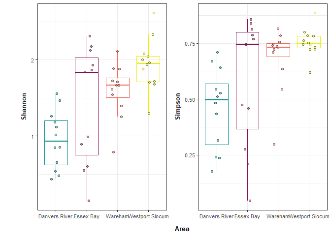
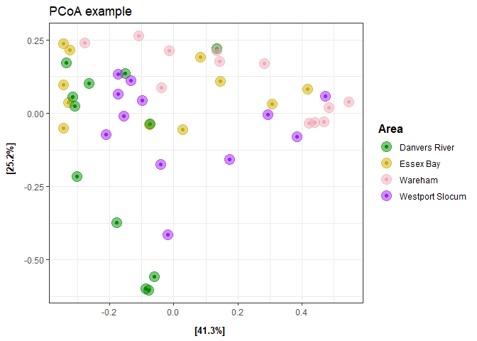
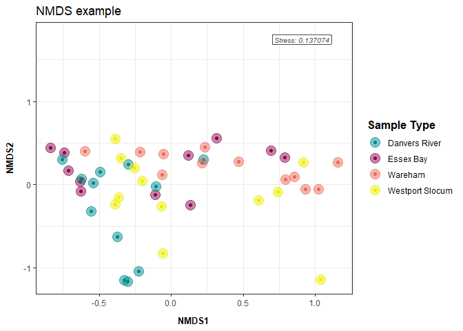

Phyloseq Diversity Metrics: eDNA metabarcoding base script
================

This script analyzes your relative abundance matrix to assess alpha and
beta diversity. Figures produced are potentially part of the main
figures of your manuscript/report.

# Load libraries

``` r
library(ggplot2) ## for plotting
library(tidyverse) ## for data manipulation 
```

    ## ── Attaching core tidyverse packages ──────────────────────── tidyverse 2.0.0 ──
    ## ✔ dplyr     1.1.4     ✔ readr     2.1.5
    ## ✔ forcats   1.0.1     ✔ stringr   1.6.0
    ## ✔ lubridate 1.9.4     ✔ tibble    3.3.0
    ## ✔ purrr     1.2.0     ✔ tidyr     1.3.1
    ## ── Conflicts ────────────────────────────────────────── tidyverse_conflicts() ──
    ## ✖ dplyr::filter() masks stats::filter()
    ## ✖ dplyr::lag()    masks stats::lag()
    ## ℹ Use the conflicted package (<http://conflicted.r-lib.org/>) to force all conflicts to become errors

``` r
library(phyloseq)
library(knitr)
library(readxl)
library(writexl)
library(cowplot)
```

    ## 
    ## Attaching package: 'cowplot'
    ## 
    ## The following object is masked from 'package:lubridate':
    ## 
    ##     stamp

``` r
## for stats
library(pairwiseAdonis)
```

    ## Loading required package: vegan
    ## Loading required package: permute
    ## Loading required package: cluster

``` r
library(lme4) ## for stats
```

    ## Loading required package: Matrix
    ## 
    ## Attaching package: 'Matrix'
    ## 
    ## The following objects are masked from 'package:tidyr':
    ## 
    ##     expand, pack, unpack

``` r
library(car) ## for stats
```

    ## Loading required package: carData
    ## 
    ## Attaching package: 'car'
    ## 
    ## The following object is masked from 'package:dplyr':
    ## 
    ##     recode
    ## 
    ## The following object is masked from 'package:purrr':
    ## 
    ##     some

``` r
library(stats) ## for stats
library(vegan)
library("microbiome") ## for alpha diversity functions
```

    ## 
    ## microbiome R package (microbiome.github.com)
    ##     
    ## 
    ## 
    ##  Copyright (C) 2011-2022 Leo Lahti, 
    ##     Sudarshan Shetty et al. <microbiome.github.io>
    ## 
    ## 
    ## Attaching package: 'microbiome'
    ## 
    ## The following object is masked from 'package:vegan':
    ## 
    ##     diversity
    ## 
    ## The following object is masked from 'package:ggplot2':
    ## 
    ##     alpha
    ## 
    ## The following object is masked from 'package:base':
    ## 
    ##     transform

``` r
## set seed
set.seed(1234)
```

# Load data

Before continuing with analyses, decide on what data you’re going to use
an input. Relative abundance, raw reads, rarefied counts (can be done in
phyloseq), variance stabilizing transformation (vst) from DESeq2? The
input will impact your interpretation and thus is important to decide
**before** conducting any stats to avoid bias towards a particular
result.

On the Fisheries team, we have traditionally used relative abundance and
the following code uses that dataset.

### Relative Abundance data

``` r
# Option 1: Change global options (affects all subsequent operations)
## Convert scientific notation to regular numbers
options(scipen = 999)

## Relative abundance matrix 
df <- read_xlsx("docs/eDNA 12S metab/example_output/Results_matrix_relative.xlsx") %>%
  ## removing common_name and category for now 
  dplyr::select(-Common_name, -Category) %>%
  
  ## Remove columns with NA values
  dplyr::select(where(~!any(is.na(.)))) %>%
  
  ## making species_name rownames instead of column 
  column_to_rownames(var = "Species_name") %>%
  
  # remove columns that sum to 0
  select(where(~sum(., na.rm = TRUE) != 0))
```

### Metadata

``` r
meta <- read_xlsx("docs/eDNA 12S metab/example_input/metadata_tidal_cycle.xlsx") %>%
  
    ## match sample IDs to matrix if needed 
  mutate(`GMGI Sample ID` = gsub("-", "_", `GMGI Sample ID`),
         `GMGI Sample ID` = paste0(`GMGI Sample ID`, "_12S")) %>%
  
  ## rownames are also needed in phyloseq meta table
  mutate(sampleID2=`GMGI Sample ID`) %>% column_to_rownames(var = "sampleID2") 
```

# Create phyloseq object

``` r
## Create ASV (OTU) table and meta table 
otu <- otu_table(df, taxa_are_rows = T)
meta_phyloseq <- sample_data(meta)

## Merge metadata and OTU table into one phyloseq "object"
phylo_obj <- merge_phyloseq(otu, meta_phyloseq)

## view phyloseq obj 
## expected output = otu_table() with taxa and sample numbers and sample_data() with the sample and column numbers
print(phylo_obj)
```

    ## phyloseq-class experiment-level object
    ## otu_table()   OTU Table:         [ 107 taxa and 47 samples ]
    ## sample_data() Sample Data:       [ 47 samples by 8 sample variables ]

``` r
# Ensure that your OTU table doesn't contain any NA or negative values (output should be FALSE)
any(is.na(otu_table(phylo_obj)))
```

    ## [1] FALSE

``` r
any(otu_table(phylo_obj) < 0)
```

    ## [1] FALSE

### Subsetting phyloseq object

Optional if you’d like to break your data up by a certain variable
(surface water, bottom water). If desired, uncomment the code chunk
below.

``` r
# surface <- subset_samples(phylo_obj, SampleType == "Surface Water")
# bottom <- subset_samples(phylo_obj, SampleType == "Bottom Water") 
```

# Alpha Diversity

Comparing the species diversity (shannon index or species richness) at
each site.

## Calculating Shannon Index and Species Richness

The alpha function in the microbiome package calculates several alpha
diversity indices. The most relevant are likely observed (species
richness) and diversity_shannon (shannon index).

<https://microbiome.github.io/tutorials/Alphadiversity.html>

Or use plot_richness function from:  
<https://rstudio-pubs-static.s3.amazonaws.com/1071936_6115f873acbc4dc4a30b1380cc3885fb.html>

``` r
### USER: CHANGE COLORS AS NEEDED
fill_col = c("cyan4", "deeppink4", "#ed6a5a", "yellow2")

## Calculate
alpha_div <- estimate_richness(phylo_obj, measures = c("Shannon", "Simpson")) %>%
  rownames_to_column(var = "GMGI Sample ID") %>% left_join(., meta, by = "GMGI Sample ID") 
```

    ## Warning in estimate_richness(phylo_obj, measures = c("Shannon", "Simpson")): The data you have provided does not have
    ## any singletons. This is highly suspicious. Results of richness
    ## estimates (for example) are probably unreliable, or wrong, if you have already
    ## trimmed low-abundance taxa from the data.
    ## 
    ## We recommended that you find the un-trimmed data and retry.

``` r
### USER: EDIT THE X AXIS AND THE FILL=, SHAPE= AESTHETICS 
alpha_div %>%
  gather("measurement", "value", Shannon:Simpson) %>%
  ggplot(., aes(x=Area, y=value)) +
  geom_boxplot(aes(color = Area), fill=NA, outlier.shape=NA, show.legend = FALSE) +
  geom_jitter(width=0.2, shape=21, aes(fill = Area), color = 'black', alpha=0.5) +
  facet_wrap(~measurement, scales = "free_y", strip.position = "left") +
  ## labels
  labs(x="Area", y="", fill = "Area") +
  
  scale_fill_manual(values = fill_col) +
  scale_color_manual(values = fill_col) +

  ## theme options
  theme_bw() + 
  theme(panel.background=element_blank(),
        strip.background=element_blank(),
        strip.text = element_text(size = 10, face="bold"),
        legend.position = "none",
        strip.clip = 'off',
        strip.placement = "outside",
        axis.text.y = element_text(size=8, color="grey30"),
        axis.text.x = element_text(size=8, color="grey30"),
        axis.title.y = element_text(margin = margin(t = 0, r = 10, b = 0, l = 0), size=10, face="bold"),
        axis.title.x = element_text(margin = margin(t = 10, r = 0, b = 0, l = 0), size=10, face="bold"))
```

<!-- -->

``` r
ggsave("docs/eDNA 12S metab/example_output/figures/alpha_diversity.png", width = 6, height = 4)
```

## Statistics

Test: T-test or ANOVA - Type I, II, and III:  
- \* indicates an interaction (SampleType\*Month). Usually we are
interested in the interaction of our factors.  
- + indicates an additive effect (SampleType + Month)

T-test to be used when only two groups to compare and ANOVA to be used
with 3+ groups. Al

non-parametric Kolmogorov-Smirnov test for two-group comparisons when
there are no relevant covariates

``` r
## Create model 
aov <- aov(Shannon ~ Area, data = alpha_div)

## ANOVA test on above model
Anova(aov, type = "III")
```

    ## Anova Table (Type III tests)
    ## 
    ## Response: Shannon
    ##              Sum Sq Df F value        Pr(>F)    
    ## (Intercept) 10.7970  1 45.9769 0.00000002676 ***
    ## Area         6.1493  3  8.7284     0.0001229 ***
    ## Residuals   10.0980 43                          
    ## ---
    ## Signif. codes:  0 '***' 0.001 '**' 0.01 '*' 0.05 '.' 0.1 ' ' 1

Test: If 3+ groups, Tukey Post Hoc Comparisons

``` r
TukeyHSD(aov)
```

    ##   Tukey multiple comparisons of means
    ##     95% family-wise confidence level
    ## 
    ## Fit: aov(formula = Shannon ~ Area, data = alpha_div)
    ## 
    ## $Area
    ##                                    diff          lwr       upr     p adj
    ## Essex Bay-Danvers River       0.4544881 -0.086097904 0.9950741 0.1270188
    ## Wareham-Danvers River         0.6553259  0.126622344 1.1840294 0.0097952
    ## Westport Slocum-Danvers River 0.9889786  0.460275104 1.5176822 0.0000585
    ## Wareham-Essex Bay             0.2008378 -0.339748200 0.7414238 0.7542458
    ## Westport Slocum-Essex Bay     0.5344905 -0.006095441 1.0750765 0.0536475
    ## Westport Slocum-Wareham       0.3336528 -0.195050766 0.8623563 0.3431292

# Beta Diversity

Comparing the community assemblages between sites/groups.

Resources (Read before continuing):  
- <https://ourcodingclub.github.io/tutorials/ordination/> -
<https://uw.pressbooks.pub/appliedmultivariatestatistics/chapter/comparison-of-ordination-techniques/>

Common options:  
- Principal Components Analysis (PCA): Euclidean distance measure  
- Principal Coordinates Analysis (PCoA): Dissimilarity distance based  
- Non-metric MultiDimensional Scaling (NMDS): Dissimilarity distance
based

PCoA and NMDS handle zero’s in community matrices much better than PCA.
For metabarcoding data, usually PCoA and NMDS are more appropriate. The
differences between PCoA and NMDS are minor compared to difference
between PCA. NMDS is iterative and used a different ordering method (see
resource links above for more info).

NMDS requires evaluation of the output ‘stress value’: This value tells
you how well the model fit your data. This is helpful to include on your
NMDS plot in reports/manuscripts/presentations.

Stress (0-1 scale) Interpretation `< 0.05` = Excellent representation
with no prospect of misinterpretation `< 0.10` = Good ordination with no
real disk of drawing false inferences `< 0.20` = Can be useful but has
potential to mislead. In particular, shouldn’t place too much reliance
on the details `> 0.20` = Could be dangerous to interpret `> 0.35` =
Samples placed essentially at random; little relation to original ranked
distances

If your stress value is \>0.2, do not include in analyses and try PCoA
instead.

## Calculating dissimilarity matrix

``` r
## Bray Curtis Dissimilarity Matrix (used in statistics)
bray_df <- phyloseq::distance(phylo_obj, method = "bray")

## Sample information
sample_df <- data.frame(sample_data(phylo_obj))
```

## Plotting

### PCoA

<https://www.rdocumentation.org/packages/phyloseq/versions/1.16.2/topics/ordinate>

``` r
## Conduct PCoA 
pcoa <- ordinate(physeq = phylo_obj, method = "PCoA", distance = "bray")

## Plotting
plot_ordination(phylo_obj, pcoa, 
                
                ## USER EDITS shape, color, alpha, fill, etc. as desired based on project metadata
                color = "Area") +
  
  ## Point and point aesthetics
  geom_point(aes(color = Area), alpha = .5, size = 5) +
  scale_color_manual(values = c("green4", "gold3", "pink2", "purple")) +

  ## Labels: USER EDITS as desired
  labs(color = "Area") +
  ggtitle("PCoA example") +
  
  ## Theme: USER EDITS as desired
  theme_bw() +
  theme(
    legend.title = element_text(face = "bold", size=12),
    legend.position = "right",
    axis.title.y = element_text(margin = margin(t = 0, r = 10, b = 0, l = 0), size=10, face="bold"),
    axis.title.x = element_text(margin = margin(t = 10, r = 0, b = 0, l = 0), size=10, face="bold"),
  ) 
```

    ## Warning: `aes_string()` was deprecated in ggplot2 3.0.0.
    ## ℹ Please use tidy evaluation idioms with `aes()`.
    ## ℹ See also `vignette("ggplot2-in-packages")` for more information.
    ## ℹ The deprecated feature was likely used in the phyloseq package.
    ##   Please report the issue at <https://github.com/joey711/phyloseq/issues>.
    ## This warning is displayed once every 8 hours.
    ## Call `lifecycle::last_lifecycle_warnings()` to see where this warning was
    ## generated.

<!-- -->

``` r
## USER EDITS WIDTH AND HEIGHT TO DESIRED   
ggsave("docs/eDNA 12S metab/example_output/figures/PCoA_phyloseq.png", width = 8, height = 6)
```

### NMDS

``` r
## Calculating NMDS 
## filtering example if needed
# phylo_obj_filtered <- prune_samples(sample_data(phylo_obj)$SampleType != "Blank", phylo_obj)

NMDS <- ordinate(physeq = phylo_obj, method = "NMDS", distance = "bray")
```

    ## Run 0 stress 0.1376309 
    ## Run 1 stress 0.1370744 
    ## ... New best solution
    ## ... Procrustes: rmse 0.02221491  max resid 0.143476 
    ## Run 2 stress 0.1470867 
    ## Run 3 stress 0.1923516 
    ## Run 4 stress 0.1376309 
    ## Run 5 stress 0.1482419 
    ## Run 6 stress 0.220068 
    ## Run 7 stress 0.1370774 
    ## ... Procrustes: rmse 0.001530697  max resid 0.007618404 
    ## ... Similar to previous best
    ## Run 8 stress 0.1476366 
    ## Run 9 stress 0.1370775 
    ## ... Procrustes: rmse 0.001634314  max resid 0.007749731 
    ## ... Similar to previous best
    ## Run 10 stress 0.1878113 
    ## Run 11 stress 0.1376309 
    ## Run 12 stress 0.1376309 
    ## Run 13 stress 0.1823485 
    ## Run 14 stress 0.1370773 
    ## ... Procrustes: rmse 0.001557422  max resid 0.00766044 
    ## ... Similar to previous best
    ## Run 15 stress 0.1482753 
    ## Run 16 stress 0.1799031 
    ## Run 17 stress 0.1841584 
    ## Run 18 stress 0.1983297 
    ## Run 19 stress 0.184445 
    ## Run 20 stress 0.1376224 
    ## *** Best solution repeated 3 times

``` r
## Plotting
plot_ordination(phylo_obj, NMDS, 
                
                ## USER EDITS shape, color, alpha, fill, etc. as desired based on project metadata
                color = "Area") +
  
  ## Point and point aesthetics
  geom_point(aes(color = Area), alpha = .5, size = 5) +
  scale_color_manual(values = fill_col) +

  ## Labels: USER EDITS as desired
  labs(color = "Sample Type") +
  ggtitle("NMDS example") +
  
  ## adding stress value to plot (user edits x and y to desired location)
  annotate(geom = "label", x = 0.7, y = 1.8, 
           label = sprintf("Stress: %.6f", NMDS$stress), hjust = 0, vjust = 1, 
           label.size = NA, fontface = "italic", color = "grey30", size = 2.75, fill="white") +
  
  ## Theme: USER EDITS as desired
  theme_bw() +
  theme(
    legend.title = element_text(face = "bold", size=12),
    legend.position = "right",
    axis.title.y = element_text(margin = margin(t = 0, r = 10, b = 0, l = 0), size=10, face="bold"),
    axis.title.x = element_text(margin = margin(t = 10, r = 0, b = 0, l = 0), size=10, face="bold"),
  ) 
```

    ## Warning in annotate(geom = "label", x = 0.7, y = 1.8, label = sprintf("Stress:
    ## %.6f", : Ignoring unknown parameters: `label.size`

<!-- -->

``` r
## USER EDITS WIDTH AND HEIGHT TO DESIRED   
ggsave("docs/eDNA 12S metab/example_output/figures/NMDS_phyloseq.png", width = 8, height = 6)
```

## Statistics

Test: PERMANOVA - \* indicates an interaction (SampleType\*Month).
Usually we are interested in the interaction of our factors.  
- + indicates an additive effect (SampleType + Month)

The output will tell you which factors significantly impact the
community assemblage (matrix).

``` r
adonis2(bray_df ~ Area, data = sample_df, permutations = 99)
```

    ## Permutation test for adonis under reduced model
    ## Permutation: free
    ## Number of permutations: 99
    ## 
    ## adonis2(formula = bray_df ~ Area, data = sample_df, permutations = 99)
    ##          Df SumOfSqs      R2      F Pr(>F)   
    ## Model     3   2.0084 0.24389 4.6233   0.01 **
    ## Residual 43   6.2264 0.75611                 
    ## Total    46   8.2348 1.00000                 
    ## ---
    ## Signif. codes:  0 '***' 0.001 '**' 0.01 '*' 0.05 '.' 0.1 ' ' 1

Additional test: Pairwise PERMANOVA

The output will tell you which specific variable within each factor is
driving the significant effects.

``` r
pairwise.adonis2(bray_df ~ Area, data = sample_df)
```

    ## $parent_call
    ## [1] "bray_df ~ Area , strata = Null , permutations 999"
    ## 
    ## $`Danvers River_vs_Essex Bay`
    ##          Df SumOfSqs      R2      F Pr(>F)  
    ## Model     1   0.4460 0.13329 3.2297  0.027 *
    ## Residual 21   2.8999 0.86671                
    ## Total    22   3.3459 1.00000                
    ## ---
    ## Signif. codes:  0 '***' 0.001 '**' 0.01 '*' 0.05 '.' 0.1 ' ' 1
    ## 
    ## $`Danvers River_vs_Wareham`
    ##          Df SumOfSqs      R2    F Pr(>F)    
    ## Model     1   1.2939 0.31678 10.2  0.001 ***
    ## Residual 22   2.7907 0.68322                
    ## Total    23   4.0847 1.00000                
    ## ---
    ## Signif. codes:  0 '***' 0.001 '**' 0.01 '*' 0.05 '.' 0.1 ' ' 1
    ## 
    ## $`Danvers River_vs_Westport Slocum`
    ##          Df SumOfSqs      R2      F Pr(>F)   
    ## Model     1   0.5645 0.13984 3.5766  0.007 **
    ## Residual 22   3.4723 0.86016                 
    ## Total    23   4.0368 1.00000                 
    ## ---
    ## Signif. codes:  0 '***' 0.001 '**' 0.01 '*' 0.05 '.' 0.1 ' ' 1
    ## 
    ## $`Essex Bay_vs_Wareham`
    ##          Df SumOfSqs      R2      F Pr(>F)  
    ## Model     1   0.7194 0.20711 5.4853  0.011 *
    ## Residual 21   2.7541 0.79289                
    ## Total    22   3.4735 1.00000                
    ## ---
    ## Signif. codes:  0 '***' 0.001 '**' 0.01 '*' 0.05 '.' 0.1 ' ' 1
    ## 
    ## $`Essex Bay_vs_Westport Slocum`
    ##          Df SumOfSqs      R2      F Pr(>F)  
    ## Model     1   0.4763 0.12176 2.9116  0.022 *
    ## Residual 21   3.4357 0.87824                
    ## Total    22   3.9120 1.00000                
    ## ---
    ## Signif. codes:  0 '***' 0.001 '**' 0.01 '*' 0.05 '.' 0.1 ' ' 1
    ## 
    ## $`Wareham_vs_Westport Slocum`
    ##          Df SumOfSqs      R2      F Pr(>F)  
    ## Model     1   0.5013 0.13096 3.3153  0.028 *
    ## Residual 22   3.3265 0.86904                
    ## Total    23   3.8278 1.00000                
    ## ---
    ## Signif. codes:  0 '***' 0.001 '**' 0.01 '*' 0.05 '.' 0.1 ' ' 1
    ## 
    ## attr(,"class")
    ## [1] "pwadstrata" "list"
