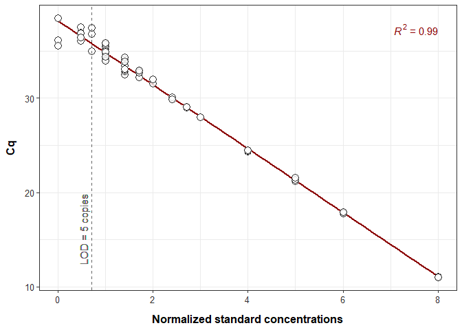
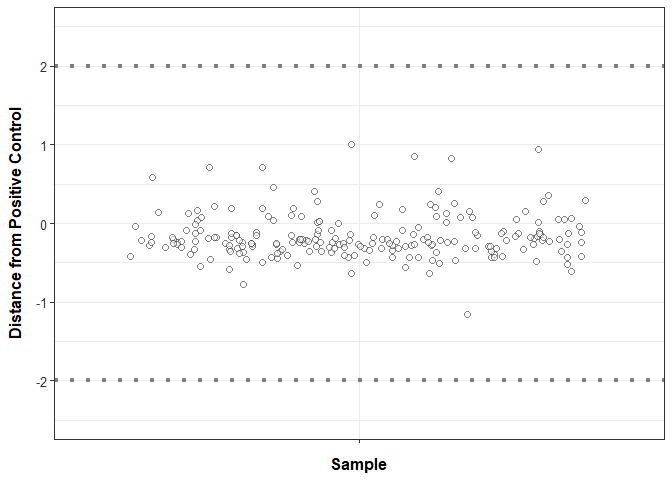
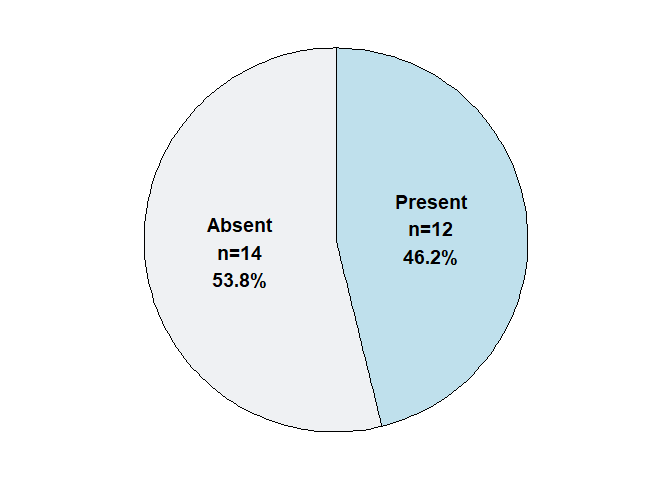
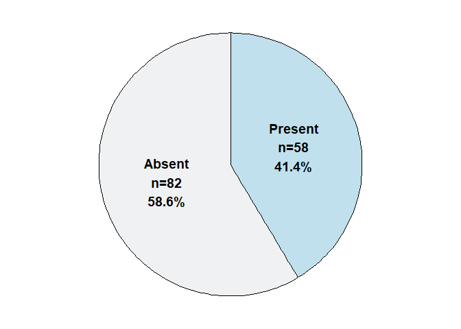
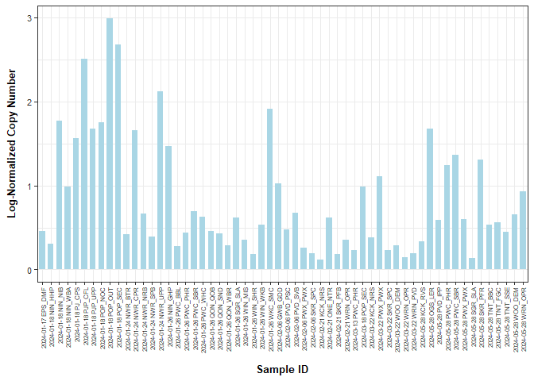
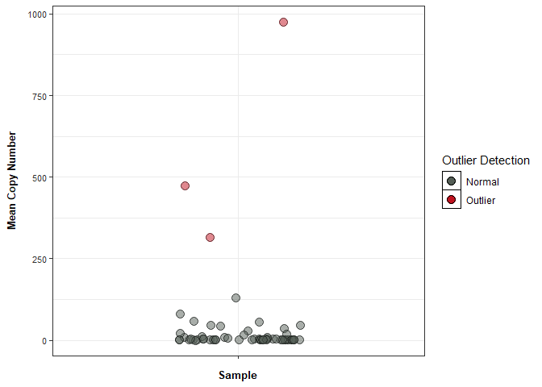

qPCR data sheets
================

**.Rmd script**

## Load libraries

``` r
library(ggplot2) ## for plotting
library(dplyr) ## for data table manipulation
```

    ## 
    ## Attaching package: 'dplyr'

    ## The following objects are masked from 'package:stats':
    ## 
    ##     filter, lag

    ## The following objects are masked from 'package:base':
    ## 
    ##     intersect, setdiff, setequal, union

``` r
library(tidyr) ## for data table manipulation
library(readr) ## for reading in tsv files
library(readxl) ## for reading in excel files
library(stringr) ## for data transformation
library(strex) ## for data transformation
library(writexl) ## for excel output
library(purrr) ## for data transformation
library(tidyverse) ## for data table manipulation
```

    ## ── Attaching core tidyverse packages ──────────────────────── tidyverse 2.0.0 ──
    ## ✔ forcats   1.0.0     ✔ tibble    3.2.1
    ## ✔ lubridate 1.9.3

    ## ── Conflicts ────────────────────────────────────────── tidyverse_conflicts() ──
    ## ✖ dplyr::filter() masks stats::filter()
    ## ✖ dplyr::lag()    masks stats::lag()
    ## ℹ Use the conflicted package (<http://conflicted.r-lib.org/>) to force all conflicts to become errors

``` r
library(ggrepel)  ## For geom_text_repel
library(drc) ## for LOD calculations
```

    ## Loading required package: MASS
    ## 
    ## Attaching package: 'MASS'
    ## 
    ## The following object is masked from 'package:dplyr':
    ## 
    ##     select
    ## 
    ## 
    ## 'drc' has been loaded.
    ## 
    ## Please cite R and 'drc' if used for a publication,
    ## for references type 'citation()' and 'citation('drc')'.
    ## 
    ## 
    ## Attaching package: 'drc'
    ## 
    ## The following objects are masked from 'package:stats':
    ## 
    ##     gaussian, getInitial

``` r
library(ggpubr)
```

## Evaluating standard curve

### Reading in data

``` r
### USER EDITS:
## 1. Replace path of file with your own standard curve
std_curve <- read_xlsx("example standard curve.xlsx", skip = 19) %>%
  group_by(Sample) %>%
  
  ## calculate detection rates (number of Cqs present / number of replicates)
  mutate(detection_rate = sum(!is.na(Cq)) / n(),
         
  ## calculate Cq stats - mean, SD, and CV 
         Cq_mean = mean(Cq, na.rm=TRUE),
         Cq_sd = sd(Cq, na.rm=TRUE),
         Cq_cv = (Cq_sd / Cq_mean) * 100 
         ) %>%
  ungroup()

## confirming negatives were clean and filter them out
std_curve %>% filter(Sample == "neg")
```

    ## # A tibble: 3 × 11
    ##   Well  Fluor Target  Content Sample    Cq Starting Quantity (S…¹ detection_rate
    ##   <chr> <chr> <chr>   <chr>   <chr>  <dbl>                  <dbl>          <dbl>
    ## 1 F12   SYBR  Library NTC     neg       NA                     NA              0
    ## 2 G12   SYBR  Library NTC     neg       NA                     NA              0
    ## 3 H12   SYBR  Library NTC     neg       NA                     NA              0
    ## # ℹ abbreviated name: ¹​`Starting Quantity (SQ)`
    ## # ℹ 3 more variables: Cq_mean <dbl>, Cq_sd <dbl>, Cq_cv <dbl>

``` r
std_curve <- std_curve %>% filter(!Sample == "neg")
```

### Calculating LOD and LOQ

``` r
LOD <- std_curve %>%
  filter(detection_rate < 0.95) %>%      # Change the threshold as needed
  slice(1) %>%                        # Get the first occurrence
  dplyr::select(Sample, detection_rate)      # Select relevant columns

LOD_threshold <- as.numeric(LOD$Sample[1])

LOQ <- std_curve %>%
  filter(Cq_cv > 35.00) %>%      # Change the threshold as needed
  slice(1) %>%                        # Get the first occurrence
  dplyr::select(Sample, Cq_cv) 

LOQ_threshold <- as.numeric(LOQ$Sample[1])
```

### Plotting standard curve

``` r
std_curve %>% 
  ## Taking only those detections with >50% to make curve 
  filter(detection_rate > 0.50) %>%
  
  ## Plotting that std. curve 
  ggplot(., aes(x = log10(`Starting Quantity (SQ)`), y = Cq)) +
  
  geom_smooth(method = 'lm', se = FALSE, color = "darkred") +

  stat_regline_equation(size = 4, color = 'darkred',
                        aes(label = after_stat(rr.label)), hjust=1,
                        label.x.npc = "right", label.y.npc = "top") +
  
  geom_point(color = 'black', fill = 'white', shape = 21, size = 3.5, alpha=0.8) +
  
  ## ADDING LOD LINE -- if no line shows up, all st. curve is qualitative 
  geom_vline(xintercept=log10(LOD_threshold), linetype="dashed", color = "grey40") +
  geom_text(aes(x = log10(LOD_threshold), y = max(std_curve$Cq, na.rm=TRUE) * 0.3,
                label = paste("LOD =", LOD_threshold, "copies")), 
            angle = 90, vjust = -0.5, hjust = -0.1, color = "grey40", size = 4) +
  
  ## ADDING LOQ LINE -- if no line shows up, all st. curve is quantitative 
  geom_vline(xintercept=log10(LOQ_threshold), linetype="dashed", color = "grey40") +
  geom_text(aes(x = log10(LOQ_threshold), y = max(std_curve$Cq, na.rm=TRUE) * 0.3, 
                label = paste("LOQ =", LOQ_threshold, "copies")), 
            angle = 90, vjust = -0.5, hjust = -0.1, color = "grey40", size = 4) +

  theme_bw() +
  
  labs(
    x = "Normalized standard concentrations",
    y = "Cq"
  ) +
  
  theme(axis.text.y = element_text(size=10, color="grey20"),
        axis.text.x = element_text(size=10, color="grey20"),
        axis.title.y = element_text(margin = margin(t = 0, r = 10, b = 0, l = 0), size=12, face="bold"),
        axis.title.x = element_text(margin = margin(t = 10, r = 0, b = 0, l = 0), size=12, face="bold"))
```

    ## Warning: Use of `std_curve$Cq` is discouraged.
    ## ℹ Use `Cq` instead.

    ## Warning in geom_text(aes(x = log10(LOD_threshold), y = max(std_curve$Cq, : All aesthetics have length 1, but the data has 93 rows.
    ## ℹ Please consider using `annotate()` or provide this layer with data containing
    ##   a single row.

    ## Warning: Use of `std_curve$Cq` is discouraged.
    ## ℹ Use `Cq` instead.

    ## Warning in geom_text(aes(x = log10(LOQ_threshold), y = max(std_curve$Cq, : All aesthetics have length 1, but the data has 93 rows.
    ## ℹ Please consider using `annotate()` or provide this layer with data containing
    ##   a single row.

    ## `geom_smooth()` using formula = 'y ~ x'

    ## Warning: Removed 2 rows containing non-finite outside the scale range
    ## (`stat_smooth()`).

    ## Warning: Removed 2 rows containing non-finite outside the scale range
    ## (`stat_regline_equation()`).

    ## Warning: Removed 2 rows containing missing values or values outside the scale range
    ## (`geom_point()`).

    ## Warning: Removed 1 row containing missing values or values outside the scale range
    ## (`geom_vline()`).

    ## Warning: Removed 93 rows containing missing values or values outside the scale range
    ## (`geom_text()`).

<!-- -->

``` r
ggsave("example output/Standard_curve.png", width=6, height=4)
```

    ## Warning: Use of `std_curve$Cq` is discouraged.
    ## ℹ Use `Cq` instead.

    ## Warning in geom_text(aes(x = log10(LOD_threshold), y = max(std_curve$Cq, : All aesthetics have length 1, but the data has 93 rows.
    ## ℹ Please consider using `annotate()` or provide this layer with data containing
    ##   a single row.

    ## Warning: Use of `std_curve$Cq` is discouraged.
    ## ℹ Use `Cq` instead.

    ## Warning in geom_text(aes(x = log10(LOQ_threshold), y = max(std_curve$Cq, : All aesthetics have length 1, but the data has 93 rows.
    ## ℹ Please consider using `annotate()` or provide this layer with data containing
    ##   a single row.

    ## `geom_smooth()` using formula = 'y ~ x'

    ## Warning: Removed 2 rows containing non-finite outside the scale range
    ## (`stat_smooth()`).

    ## Warning: Removed 2 rows containing non-finite outside the scale range
    ## (`stat_regline_equation()`).

    ## Warning: Removed 2 rows containing missing values or values outside the scale range
    ## (`geom_point()`).

    ## Warning: Removed 1 row containing missing values or values outside the scale range
    ## (`geom_vline()`).

    ## Warning: Removed 93 rows containing missing values or values outside the scale range
    ## (`geom_text()`).

### Calculating slope and y-intercept

These values get fed in later in data calculations.

``` r
# Fit a linear model to calculate slope and intercept
linear_model <- lm(Cq_mean ~ log10(`Starting Quantity (SQ)`), data = std_curve)

# Extract slope and y-intercept
slope <- coef(linear_model)[2]      # Slope (m)
y_intercept <- coef(linear_model)[1] # Y-intercept (b)
```

## Reading in datafiles and merging into one large dataframe

``` r
### USER EDITS:
## 1. Replace path of files 
## 2. In str_after_nth(file.ID, "results/", 1), make sure this matches the folder ending referenced in list.files

df <- 
  # list files in directory following a particular pattern
  list.files(path = 'example input/qPCR_results/', pattern = ".xlsx", full.names = TRUE) %>%
  
  # get the column names
  set_names(.) %>% 
  
  # join all files together in one data frame by file ID, skipping first 19 rows
  map_dfr(~read_xlsx(., skip = 19), .id = "file.ID") %>% 
  
  # turn file.ID into just plate information (plate.ID)
  mutate(file.ID = str_after_nth(file.ID, "results/", 1),
         file.ID = str_before_nth(file.ID, ".xlsx", 1)) %>%
  dplyr::rename(plate.ID = file.ID, Sample_ID = Sample) %>%
  
  ## RI STRIPED BASS SPECIFIC CODE FOR SAMPLE ID MISMATCHES
  mutate(Sample_ID = gsub(" #1", "_1", Sample_ID),
         Sample_ID = gsub(" #2", "_2", Sample_ID)) %>%
  
  mutate(Sample_ID = case_when(
    str_detect(Well, "4") & Sample_ID == "2/21/24_ONE_NTR" ~ paste0(Sample_ID, "_1"),
    str_detect(Well, "5") & Sample_ID == "2/21/24_ONE_NTR" ~ paste0(Sample_ID, "_2"),
    TRUE ~ Sample_ID
  ))

head(df)
```

    ## # A tibble: 6 × 8
    ##   plate.ID     Well  Fluor Target Content Sample_ID    Cq Starting Quantity (S…¹
    ##   <chr>        <chr> <chr> <chr>  <chr>   <chr>     <dbl> <lgl>                 
    ## 1 26 AUG 2024… A01   SYBR  Libra… Unkn    1/17/24_…  NA   NA                    
    ## 2 26 AUG 2024… A02   SYBR  Libra… Unkn    1/17/24_…  NA   NA                    
    ## 3 26 AUG 2024… A03   SYBR  Libra… Unkn    1/17/24_…  NA   NA                    
    ## 4 26 AUG 2024… A04   SYBR  Libra… Unkn    1/17/24_…  34.8 NA                    
    ## 5 26 AUG 2024… A05   SYBR  Libra… Unkn    1/17/24_…  NA   NA                    
    ## 6 26 AUG 2024… A06   SYBR  Libra… Unkn    1/17/24_…  NA   NA                    
    ## # ℹ abbreviated name: ¹​`Starting Quantity (SQ)`

## Reading in meta df

Sample ID from meta needs to match the Sample ID from the qPCR output

``` r
meta <- read_xlsx("example input/client_metadata_example.xlsx") %>%
  
  ## RI STRIPED BASS SPECIFIC CODE FOR SAMPLE ID ISSUES
  ## For other projects, address any Sample_ID differences (Sample_ID on qPCR output needs to match meta)
  mutate(Sample_ID = gsub(" #1", "_1", Sample_ID),
         Sample_ID = gsub(" #2", "_2", Sample_ID))
```

## Evaluating No Template Controls (NTCs; Negatives)

``` r
NTC <- df %>% 
  filter(grepl("neg", Sample_ID, ignore.case = TRUE))

## Calculate number of negatives with Cq values 
sum(!is.na(NTC$Cq))
```

    ## [1] 1

``` r
## Calculate number of negatives total 
nrow(NTC)
```

    ## [1] 120

``` r
## Calculate number of plates
length(unique(NTC$plate.ID))
```

    ## [1] 20

## Spike information

For each sample, calculate the distance from the Positive Spike-in
value.

``` r
spike_samples <- df %>% 
  ## subset to spiked samples 
  filter(grepl("spike|pos", Sample_ID, ignore.case = TRUE)) %>%
  
  ## remove spike from SampleID column only if 'pos' is NOT in the Sample_ID
  mutate(Sample_ID = case_when(
    !grepl("pos", Sample_ID, ignore.case = TRUE) ~ str_before_nth(Sample_ID, " spike", 1),
    TRUE ~ Sample_ID
  )) %>%

  ## group by plate ID and sample ID 
  group_by(plate.ID, Sample_ID) %>%

  ## calculate mean of spikes per plate and sample 
  ## ungroup by Sample_ID so the next calculation is only done grouped by Plate 
  mutate(Filter_Cq = mean(Cq)) %>% 
  ungroup(Sample_ID) %>%

  ## calculate difference from plate's Cq value 
  mutate(Cq_diff = Filter_Cq - Filter_Cq[grepl("pos", Sample_ID, ignore.case = TRUE)]) %>%
  ungroup(); spike_samples
```

    ## # A tibble: 480 × 10
    ##    plate.ID    Well  Fluor Target Content Sample_ID    Cq Starting Quantity (S…¹
    ##    <chr>       <chr> <chr> <chr>  <chr>   <chr>     <dbl> <lgl>                 
    ##  1 26 AUG 202… G01   SYBR  Libra… Unkn    1/17/24_…  10.5 NA                    
    ##  2 26 AUG 202… G02   SYBR  Libra… Unkn    1/17/24_…  10.6 NA                    
    ##  3 26 AUG 202… G03   SYBR  Libra… Unkn    1/17/24_…  10.8 NA                    
    ##  4 26 AUG 202… G04   SYBR  Libra… Unkn    1/17/24_…  10.8 NA                    
    ##  5 26 AUG 202… G05   SYBR  Libra… Unkn    1/17/24_…  10.5 NA                    
    ##  6 26 AUG 202… G06   SYBR  Libra… Unkn    1/17/24_…  11.0 NA                    
    ##  7 26 AUG 202… G07   SYBR  Libra… Unkn    1/17/24_…  10.8 NA                    
    ##  8 26 AUG 202… G08   SYBR  Libra… Unkn    1/17/24_…  11.0 NA                    
    ##  9 26 AUG 202… G09   SYBR  Libra… Unkn    1/17/24_…  10.7 NA                    
    ## 10 26 AUG 202… G10   SYBR  Libra… Unkn    1/18/24_…  10.9 NA                    
    ## # ℹ 470 more rows
    ## # ℹ abbreviated name: ¹​`Starting Quantity (SQ)`
    ## # ℹ 2 more variables: Filter_Cq <dbl>, Cq_diff <dbl>

``` r
## Remove any lab error samples 
## RI Striped Bass only 
## removing 2/21/24 DI Blank 1 (pipetting issue) 
spike_samples <- spike_samples %>%
  filter(!Sample_ID == "2/21/24_Tap Blank_1")
```

Plot those distance values and save to output folder

``` r
# Create a jitter position object
jitter_pos <- position_jitter(width = 0.45, seed = 123)

## Plot samples 
spike_samples %>% dplyr::select(Target, Sample_ID, Cq_diff) %>% distinct() %>%
  
  ggplot(., aes(x=Target, y = Cq_diff)) + 
  geom_hline(yintercept = c(-2, 2), linetype = "dotted", color = "grey50", size=1.5) +
  
  geom_jitter(aes(fill = abs(Cq_diff) > 2), 
              size = 2, alpha = 0.5, color = 'black', shape = 21, #width = 0.45,
              position = jitter_pos) +
  
  scale_fill_manual(values = c("TRUE" = "red", "FALSE" = "white")) +
  geom_text_repel(
    aes(label = ifelse(abs(Cq_diff) > 2, Sample_ID, "")),  position = jitter_pos,
    size = 3, box.padding = 0.5, point.padding = 0.2, force = 2
  ) +
  
  labs(
    x = "Sample",
    y = "Distance from Positive Control"
  ) +
  
  theme_bw() +
  
  ## keep y axis at least -2,2 but extend to max 
  coord_cartesian(
    ylim = c(
      min(-2.5, min(spike_samples$Cq_diff, na.rm = TRUE)),
      max(2.5, max(spike_samples$Cq_diff, na.rm = TRUE))
    )) +
  
  ## theme variables
    theme(panel.background=element_rect(fill='white', colour='black'),
        legend.position = "none",
        axis.text.y = element_text(size=10, color="grey20"),
        axis.text.x = element_blank(),
        axis.title.y = element_text(margin = margin(t = 0, r = 10, b = 0, l = 0), size=12, face="bold"),
        axis.title.x = element_text(margin = margin(t = 10, r = 0, b = 0, l = 0), size=12, face="bold"))
```

    ## Warning: Using `size` aesthetic for lines was deprecated in ggplot2 3.4.0.
    ## ℹ Please use `linewidth` instead.
    ## This warning is displayed once every 8 hours.
    ## Call `lifecycle::last_lifecycle_warnings()` to see where this warning was
    ## generated.

<!-- -->

``` r
ggsave("example output/Inhibition.png", width=4, height=4)
```

## Filter data Cq, Number of Replicates, and Copy Num calculations

``` r
## Complete calculations
filters_df <- df %>% 
  ## subset out the spiked samples 
  filter(!grepl("spike|pos|neg", Sample_ID, ignore.case = TRUE)) %>%

  ## group by plate ID and sample ID 
  group_by(plate.ID, Sample_ID) %>%

  ## calculate mean of Cq per plate and sample, replacing NaN with NA
  mutate(Filter_Cq = if_else(is.nan(mean(Cq, na.rm = TRUE)), NA_real_, mean(Cq, na.rm = TRUE))) %>%
  
  ## calculate # of replicates 
  mutate(Filter_Num_Replicates = sum(!is.na(Cq))) %>%
  
  ## calculate copy number 
  mutate(Filter_Copy_Num = 10^((Filter_Cq-y_intercept)/slope)) %>%
  
  ## summarize df with specific columns 
  dplyr::select(plate.ID, Sample_ID, Filter_Cq, Filter_Num_Replicates, Filter_Copy_Num) %>% 
  distinct() %>% ungroup()
```

## Addressing duplicate samples (a.k.a., re-runs)

This code assumes the user wants to always use the most recent plate if
completing a sample for a 2nd time. *If this is not the case, chat with
Fisheries team to make sure code reflect user’s needs.*

``` r
filters_df <- filters_df %>%
  ## Separating Plate.ID into Date and Plate Number
  separate(plate.ID, c("Plate_date", "Plate_number"), sep = " PLATE") %>%
  
  ## Change Date column to a Date format 
  mutate(Plate_date = dmy(Plate_date)) %>%
  
  ## Group by Sample_ID and keep only the row with the most recent date
  group_by(Sample_ID) %>%
  slice_max(Plate_date, n = 1, with_ties = FALSE) %>% ungroup()

## confirm the number of rows matches the number of unique Sample IDs (output should be TRUE)
nrow(filters_df) == length(unique(filters_df$Sample_ID))
```

    ## [1] TRUE

## Combing with meta and collapsing by sample

``` r
samples_df <- filters_df %>% right_join(meta, ., by = "Sample_ID") %>%
  group_by(Date, Sample_Location) %>%
  
  ## mutate to mean Ct value
  mutate(`Mean Ct` = if_else(is.nan(mean(Filter_Cq, na.rm = TRUE)), 
                                    NA_real_, mean(Filter_Cq, na.rm = TRUE)),
         
         ## take highest value of number of replicates
         `Number of Replicates` = max(Filter_Num_Replicates, na.rm=TRUE),
         
         ## sum of 2 copy number values 
         `Mean Copy Number` = ifelse(sum(Filter_Copy_Num, na.rm=TRUE) == 0, NA, 
                            sum(Filter_Copy_Num, na.rm=TRUE))
           ) %>%
  
  ungroup() %>%
  
  ## summarizing df 
  dplyr::select(Date, Sample_Location, Sample_Type, Number_of_Filters, 
                `Mean Ct`, `Number of Replicates`, `Mean Copy Number`) %>%
  distinct() %>%

  ## adding new SampleID back in
  unite(Sample_ID, Date, Sample_Location, sep = " ", remove=F)

head(samples_df)
```

    ## # A tibble: 6 × 8
    ##   Sample_ID    Date                Sample_Location Sample_Type Number_of_Filters
    ##   <chr>        <dttm>              <chr>           <chr>       <lgl>            
    ## 1 2024-01-17 … 2024-01-17 00:00:00 DI Blank #1     Blank       NA               
    ## 2 2024-01-17 … 2024-01-17 00:00:00 DI Blank #2     Blank       NA               
    ## 3 2024-01-17 … 2024-01-17 00:00:00 GBP_OCA         Field       NA               
    ## 4 2024-01-17 … 2024-01-17 00:00:00 IPC_GCO         Field       NA               
    ## 5 2024-01-17 … 2024-01-17 00:00:00 IPC_BBC         Field       NA               
    ## 6 2024-01-17 … 2024-01-17 00:00:00 NAN_EDI         Field       NA               
    ## # ℹ 3 more variables: `Mean Ct` <dbl>, `Number of Replicates` <int>,
    ## #   `Mean Copy Number` <dbl>

``` r
## Confirm that the number of samples output from qPCR matches the number of samples in the metadata  
nrow(samples_df) == nrow(meta %>% dplyr::select(-Sample_ID) %>% distinct())
```

    ## [1] TRUE

## Normalizing data

``` r
## normalize data 
normalized_df <- samples_df %>%
  ## take log10 of copy number 
  mutate(`Mean Copy Number Normalized` = log10(`Mean Copy Number` + 1))
        
## create an outlier cut-off 
cutoff <- quantile(normalized_df$`Mean Copy Number Normalized`, na.rm = TRUE, probs=0.75) + 
  1.5*IQR(normalized_df$`Mean Copy Number Normalized`, na.rm=TRUE)

## create an outlier cut-off 
cutoff_below <- quantile(normalized_df$`Mean Copy Number Normalized`, na.rm = TRUE, probs=0.25) - 
  1.5*IQR(normalized_df$`Mean Copy Number Normalized`, na.rm=TRUE)

## Output the values that outside the cutoff
normalized_df %>% filter(`Mean Copy Number Normalized` > cutoff) 
```

    ## # A tibble: 3 × 9
    ##   Sample_ID    Date                Sample_Location Sample_Type Number_of_Filters
    ##   <chr>        <dttm>              <chr>           <chr>       <lgl>            
    ## 1 2024-01-18 … 2024-01-18 00:00:00 POP_SEC         Field       NA               
    ## 2 2024-01-18 … 2024-01-18 00:00:00 POP_OUT         Field       NA               
    ## 3 2024-01-18 … 2024-01-18 00:00:00 PJP_CFL         Field       NA               
    ## # ℹ 4 more variables: `Mean Ct` <dbl>, `Number of Replicates` <int>,
    ## #   `Mean Copy Number` <dbl>, `Mean Copy Number Normalized` <dbl>

``` r
normalized_df %>% filter(`Mean Copy Number Normalized` < cutoff_below) 
```

    ## # A tibble: 0 × 9
    ## # ℹ 9 variables: Sample_ID <chr>, Date <dttm>, Sample_Location <chr>,
    ## #   Sample_Type <chr>, Number_of_Filters <lgl>, Mean Ct <dbl>,
    ## #   Number of Replicates <int>, Mean Copy Number <dbl>,
    ## #   Mean Copy Number Normalized <dbl>

``` r
## the cutoff we move forward with is the cutoff (high) but confirm no values are below the lower cutoff value 
```

## Adding present/absent information

``` r
normalized_df <- normalized_df %>%
  mutate(Detection = case_when(
    is.na(`Mean Copy Number Normalized`) ~ "Absent",
    TRUE ~ "Present"
  ))
```

## Blank specific information

``` r
blank_df <- normalized_df %>% subset(Sample_Type == "Blank")

detection_counts <- blank_df %>%
  count(Detection) %>%
  mutate(percentage = n / sum(n) * 100,
         label = paste0(Detection, "\n", "n=", n, "\n", round(percentage, 1), "%"))

ggplot(detection_counts, aes(x = "", y = n, fill = Detection)) +
  geom_bar(stat = "identity", width = 1, color = "black", alpha=0.75) +
  coord_polar("y", start = 0) +
  geom_text(aes(label = label), 
            position = position_stack(vjust = 0.5), 
            size = 5,
            fontface = "bold") + 
  theme_void() +
  theme(legend.position = "none",
        #plot.title = element_text(hjust = 0.5, size = 16, face = "bold")
        ) +
  scale_fill_manual(values = c("#e9ecef", "#a9d6e5"))
```

<!-- -->

``` r
ggsave("example output/Blanks_piechart.png", width=4, height=4)
```

## Sample preliminary data

Pie chart

``` r
fieldsamples_df <- normalized_df %>% subset(Sample_Type == "Field")

field_detection_counts <- fieldsamples_df %>%
  count(Detection) %>%
  mutate(percentage = n / sum(n) * 100,
         label = paste0(Detection, "\n", "n=", n, "\n", round(percentage, 1), "%"))

ggplot(field_detection_counts, aes(x = "", y = n, fill = Detection)) +
  geom_bar(stat = "identity", width = 1, color = "black", alpha=0.75) +
  coord_polar("y", start = 0) +
  geom_text(aes(label = label), 
            position = position_stack(vjust = 0.5), 
            size = 5,
            fontface = "bold") + 
  theme_void() +
  theme(legend.position = "none",
        #plot.title = element_text(hjust = 0.5, size = 16, face = "bold")
        ) +
  scale_fill_manual(values = c("#e9ecef", "#a9d6e5"))
```

<!-- -->

``` r
ggsave("example output/Fields_piechart.png", width=4, height=4)
```

Bar chart

``` r
fieldsamples_df %>% 
  filter(!is.na(`Mean Copy Number Normalized`)) %>%
  ggplot(., aes(x=Sample_ID, y=`Mean Copy Number Normalized`)) + 
  geom_bar(stat = "identity", width = 0.7, fill = "#a9d6e5") +
  # scale_fill_manual(values = c("#a9d6e5", "#780000"),
  #                   labels = c("Normal", "Outlier"),
  #                   ) +
  labs(
    y="Log-Normalized Copy Number",
    x = "Sample ID",
    fill = "Outlier detection",
    #title = "Just plotting log normalized value"
  ) +
  theme_bw() +
    ## theme variables
    theme(panel.background=element_rect(fill='white', colour='black'),
        legend.position = c(0.98, 0.98),  # This puts the legend in the top right corner
        legend.justification = c(1, 1),  # This aligns the legend to the top right
        axis.text.y = element_text(size=8, color="grey20"),
        axis.text.x = element_text(size=6, color="grey20", angle=90, hjust=1, vjust=0.5),
        axis.title.y = element_text(margin = margin(t = 0, r = 10, b = 0, l = 0), size=10, face="bold"),
        axis.title.x = element_text(margin = margin(t = 10, r = 0, b = 0, l = 0), size=10, face="bold"),
        # New theme elements for strip appearance
        strip.background = element_rect(fill = "white", color = "black"),
        strip.text = element_text(face = "bold", size = 9)
    ) +
  guides(fill = guide_legend(override.aes = list(alpha = 1))) 
```

    ## Warning: A numeric `legend.position` argument in `theme()` was deprecated in ggplot2
    ## 3.5.0.
    ## ℹ Please use the `legend.position.inside` argument of `theme()` instead.
    ## This warning is displayed once every 8 hours.
    ## Call `lifecycle::last_lifecycle_warnings()` to see where this warning was
    ## generated.

<!-- -->

``` r
ggsave("example output/Fieldsamples_barchart.png", width = 9.5, height=5)
```

Show distance of outliers

``` r
fieldsamples_df %>% ggplot(., aes(x=Sample_Type, y=`Mean Copy Number`, 
                                  fill = ifelse(is.na(`Mean Copy Number Normalized`) | is.na(cutoff), FALSE, 
                                          `Mean Copy Number Normalized` > cutoff))) + 
  geom_jitter(width=0.2, size=3.5, color='black', shape=21, alpha=0.5) +
  scale_fill_manual(values = c("#545E56", "#c1121f"),
                    labels = c("Normal", "Outlier")) +
  theme_bw() +
  #geom_hline(yintercept = cutoff, linetype = "dotted", color = "grey50") +
  labs(x = "Sample",
       fill = "Outlier Detection"
       ) +
      theme(panel.background=element_rect(fill='white', colour='black'),
        legend.position = "right",
        axis.text.y = element_text(size=8, color="grey20"),
        axis.text.x = element_blank(),
        axis.title.y = element_text(margin = margin(t = 0, r = 10, b = 0, l = 0), size=10, face="bold"),
        axis.title.x = element_text(margin = margin(t = 10, r = 0, b = 0, l = 0), size=10, face="bold"),
    ) +
    guides(fill = guide_legend(override.aes = list(alpha = 1)))
```

    ## Warning: Removed 82 rows containing missing values or values outside the scale range
    ## (`geom_point()`).

<!-- -->

``` r
ggsave("example output/Outliers.png", width = 5, height=4.5)
```

    ## Warning: Removed 82 rows containing missing values or values outside the scale range
    ## (`geom_point()`).

## Exporting data

``` r
blank_df %>% mutate(Date = as.Date(Date)) %>% 
  dplyr::select(Date, Sample_Location, `Mean Ct`, `Number of Replicates`, 
                `Mean Copy Number`, `Mean Copy Number Normalized`, Detection) %>%
  
  unite(Sample, Date, Sample_Location, sep = " ", remove = TRUE) %>%
  
  # cut decimals down to 2
  mutate(across(where(is.numeric), ~round(., 2))) %>%
  
  write_xlsx("example output/Results_Blanks.xlsx")

### adding some meta for Rich 
rich_meta <- read_xlsx("C:/BoxDrive/Box/Science/Fisheries/Projects/eDNA/RI Striped Bass/metadata/eDNA_Data_RI_STB_2024.xlsx") %>%
  dplyr::rename(Date = Sample_Date, Sample_Location = Station_Code) %>%
  mutate(Sample_Time = format(Sample_Time, format = "%H:%M:%S"))


normalized_df %>% full_join(rich_meta, ., by = c("Date", "Sample_Location")) %>%
  mutate(Date = as.Date(Date)) %>%
  dplyr::select(-Number_of_Filters) %>% write_xlsx("example output/Results.xlsx")


  # dplyr::select(Date, Sample_Location, `Mean Ct`, `Number of Replicates`, 
  #               `Mean Copy Number`, `Mean Copy Number Normalized`, Detection) %>%
  # 
  # unite(Sample, Date, Sample_Location, sep = " ", remove = FALSE) %>%
  # 
  # # cut decimals down to 2
  # mutate(across(where(is.numeric), ~round(., 2))) %>%
  # 
  # write_xlsx("example output/Results.xlsx")
```
