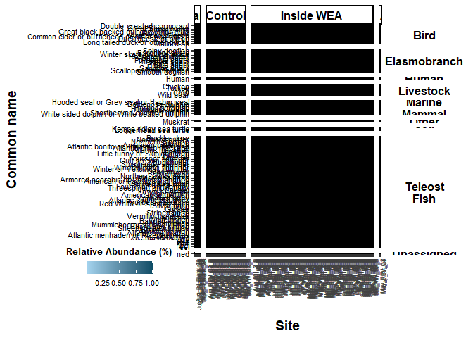

Relative Abundance Heatmaps: eDNA metabarcoding base script
================

This script plots your relative abundance matrix as a heatmap. Figures
produced are potentially part of the main figures of your
manuscript/report.

# Load libraries

``` r
library(ggplot2) ## for plotting
library(dplyr) ## for data table manipulation
```

    ## 
    ## Attaching package: 'dplyr'

    ## The following objects are masked from 'package:stats':
    ## 
    ##     filter, lag

    ## The following objects are masked from 'package:base':
    ## 
    ##     intersect, setdiff, setequal, union

``` r
library(tidyr) ## for data table manipulation
library(readxl) ## for reading in excel files
library(stringr) ## for data transformation
library(strex) ## for data transformation
library(purrr) ## for data transformation
library(funrar) ## for make_relative()
library(tidyverse) ## for data transformation
```

    ## ── Attaching core tidyverse packages ──────────────────────── tidyverse 2.0.0 ──
    ## ✔ forcats   1.0.0     ✔ readr     2.1.5
    ## ✔ lubridate 1.9.3     ✔ tibble    3.2.1

    ## ── Conflicts ────────────────────────────────────────── tidyverse_conflicts() ──
    ## ✖ dplyr::filter() masks stats::filter()
    ## ✖ dplyr::lag()    masks stats::lag()
    ## ℹ Use the conflicted package (<http://conflicted.r-lib.org/>) to force all conflicts to become errors

``` r
library(naniar) ## replace_with_na_all function
library(ggh4x) ## for facet wrap options
```

    ## 
    ## Attaching package: 'ggh4x'
    ## 
    ## The following object is masked from 'package:ggplot2':
    ## 
    ##     guide_axis_logticks

``` r
library(tidytext)
```

# Load data

``` r
df <- read_xlsx("example_output/Results_relab_long.xlsx") %>%
  mutate(across(c(relab), ~ round(.x, 5)))
```

# Remove Categories

If you want to plot relative abundance without human, other, or
livestock categories. As FYI/warning, relative abundance is calculated
with these categories included. Relative abundance can also be thought
of as proportion of total reads, which is calculated from the total
reads for that sample.

``` r
df_filtered <- df %>% 
  filter(!Category == "Other" & !Category == "Livestock" & !Category == "unassigned" & !Category == "Human") 
```

# Plot

reverse label order: scale y discrete limits reverse limits=rev

<https://coolors.co/> (hit tools on the top right hand side)

``` r
## if subset of categories is desired, replace df below with df_filtered
df %>%
  
  ## replace zeros with NAs for plotting
  replace_with_na_all(condition = ~.x == 0.00000) %>%
  
  ## ggplot basic options (USER EDIT: X AND Y AXIS)
  ggplot(., aes(x=Site, y=Common_name)) +
  geom_tile(aes(fill = relab), color = "black") +
  
  ## x, y, and legend labels (USER EDITS IF DESIRED)
  ylab("Common name") +
  xlab("Site") +
  labs(fill = "Relative Abundance (%)") +
  
  ## color of the tile options; direction=1 will flip the low/high (USER EDITS IF DESIRED)
  scale_fill_gradient(na.value = "white", low = "lightskyblue2", high = "#0C4D66") + 
  
  ## facet grid with Category and project variables
  facet_grid2(Category ~ SampleType, 
              scales = "free", space = "free", 
              labeller = labeller(Category = label_wrap_gen(width = 10))) +
  
  ## graph theme options
  theme_classic() +
  theme(
    ## axis text 
    axis.text.x = element_text(angle = 90, size=6, color="grey25", hjust = 1),
    axis.text.y = element_text(colour = 'black', size = 8),
    
    ## legend text and title 
    legend.text = element_text(size = 8, color="black"),
    legend.title = element_text(margin = margin(t = 0, r = 0, b = 5, l = 0), size=10, color="black", face="bold"),
    legend.position = c(-0.4, -0.05), 
    legend.key.height = unit(5, 'mm'),
    legend.direction = "horizontal",
    legend.key.width = unit(5, 'mm'),
    legend.title.align = 0.5,
    legend.title.position = "top",
    
    ## axis titles 
    axis.title.y = element_text(margin = margin(t = 0, r = 10, b = 0, l = 0), size=14, face="bold"),
    axis.title.x = element_text(margin = margin(t = 10, r = 0, b = 0, l = 0), size=14, face="bold"),
        
    ## facet wrap labels
    strip.text.x = element_text(color = "black", face = "bold", size = 12),
    strip.text.y = element_text(color = "black", face = "bold", size = 12, angle=0),
    strip.background.y = element_blank(),
    strip.clip = "off"
    )
```

    ## Warning: The `legend.title.align` argument of `theme()` is deprecated as of ggplot2
    ## 3.5.0.
    ## ℹ Please use theme(legend.title = element_text(hjust)) instead.
    ## This warning is displayed once every 8 hours.
    ## Call `lifecycle::last_lifecycle_warnings()` to see where this warning was
    ## generated.

    ## Warning: A numeric `legend.position` argument in `theme()` was deprecated in ggplot2
    ## 3.5.0.
    ## ℹ Please use the `legend.position.inside` argument of `theme()` instead.
    ## This warning is displayed once every 8 hours.
    ## Call `lifecycle::last_lifecycle_warnings()` to see where this warning was
    ## generated.

<!-- -->

``` r
## USER EDITS WIDTH AND HEIGHT TO DESIRED   
ggsave("example_output/Figures/Relative_abundance.png", width = 7, height = 10)  


## Group by family or order from gmgi_db info? this would break down teleost fish more
## ecological niche? functional groups? would probably require more metadata..
```
