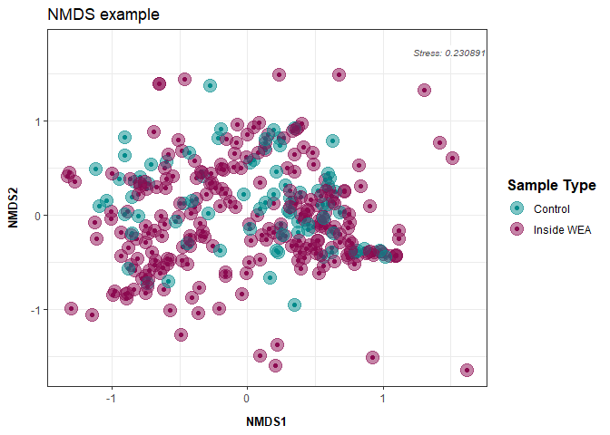

Phyloseq Diversity Metrics: eDNA metabarcoding base script
================

This script analyzes your relative abundance matrix to assess alpha and
beta diversity. Figures produced are potentially part of the main
figures of your manuscript/report.

# Load libraries

``` r
library(ggplot2) ## for plotting
library(tidyverse) ## for data manipulation 
```

    ## ── Attaching core tidyverse packages ──────────────────────── tidyverse 2.0.0 ──
    ## ✔ dplyr     1.1.4     ✔ readr     2.1.5
    ## ✔ forcats   1.0.0     ✔ stringr   1.5.1
    ## ✔ lubridate 1.9.3     ✔ tibble    3.2.1
    ## ✔ purrr     1.0.2     ✔ tidyr     1.3.1
    ## ── Conflicts ────────────────────────────────────────── tidyverse_conflicts() ──
    ## ✖ dplyr::filter() masks stats::filter()
    ## ✖ dplyr::lag()    masks stats::lag()
    ## ℹ Use the conflicted package (<http://conflicted.r-lib.org/>) to force all conflicts to become errors

``` r
library(phyloseq)
library(knitr)
library(readxl)
library(writexl)
library(cowplot)
```

    ## 
    ## Attaching package: 'cowplot'
    ## 
    ## The following object is masked from 'package:lubridate':
    ## 
    ##     stamp

``` r
## for stats
library(pairwiseAdonis)
```

    ## Loading required package: vegan
    ## Loading required package: permute
    ## Loading required package: lattice
    ## This is vegan 2.6-8
    ## Loading required package: cluster

``` r
library(lme4) ## for stats
```

    ## Loading required package: Matrix
    ## 
    ## Attaching package: 'Matrix'
    ## 
    ## The following objects are masked from 'package:tidyr':
    ## 
    ##     expand, pack, unpack

``` r
library(car) ## for stats
```

    ## Loading required package: carData
    ## 
    ## Attaching package: 'car'
    ## 
    ## The following object is masked from 'package:dplyr':
    ## 
    ##     recode
    ## 
    ## The following object is masked from 'package:purrr':
    ## 
    ##     some

``` r
library(stats) ## for stats
library(vegan)
library("microbiome") ## for alpha diversity functions
```

    ## 
    ## microbiome R package (microbiome.github.com)
    ##     
    ## 
    ## 
    ##  Copyright (C) 2011-2022 Leo Lahti, 
    ##     Sudarshan Shetty et al. <microbiome.github.io>
    ## 
    ## 
    ## Attaching package: 'microbiome'
    ## 
    ## The following object is masked from 'package:vegan':
    ## 
    ##     diversity
    ## 
    ## The following object is masked from 'package:ggplot2':
    ## 
    ##     alpha
    ## 
    ## The following object is masked from 'package:base':
    ## 
    ##     transform

``` r
## set seed
set.seed(1234)
```

# Load data

Before continuing with analyses, decide on what data you’re going to use
an input. Relative abundance, raw reads, rarefied counts (can be done in
phyloseq), variance stabilizing transformation (vst) from DESeq2? The
input will impact your interpretation and thus is important to decide
**before** conducting any stats to avoid bias towards a particular
result.

On the Fisheries team, we have traditionally used relative abundance and
the following code uses that dataset.

### Relative Abundance data

``` r
## Relative abundance matrix 
df <- read_xlsx("example_output/Results_relab_matrix.xlsx") %>%
  ## removing common_name and category for now 
  dplyr::select(-Common_name, -Category) %>%
  
  ## Remove columns with NA values
  dplyr::select(where(~!any(is.na(.)))) %>%
  
  ## making species_name rownames instead of column 
  column_to_rownames(var = "Species_name")

head(df)
```

    ##                                    Aug_501_2_S Aug_501_3_B Aug_501_3_S
    ## Alopias vulpinus                   0.000000000   0.0000000   0.0000000
    ## Ammodytes americanus or hexapterus 0.000000000   0.0000000   0.0000000
    ## Ammodytes dubius                   0.008895254   0.8093603   0.2390657
    ## Anas sp                            0.000000000   0.0000000   0.0000000
    ## Anatidae sp                        0.000000000   0.0000000   0.0000000
    ## Anguilla rostrata                  0.007288326   0.0000000   0.0000000
    ##                                    Aug_501_4_B Aug_501_4_S Aug_DI_Blank_1A
    ## Alopias vulpinus                             0 0.002853176       0.0000000
    ## Ammodytes americanus or hexapterus           0 0.000000000       0.0000000
    ## Ammodytes dubius                             0 0.115591716       0.4005637
    ## Anas sp                                      0 0.000000000       0.0000000
    ## Anatidae sp                                  0 0.000000000       0.0000000
    ## Anguilla rostrata                            0 0.000000000       0.0000000
    ##                                    Aug_DI_Blank_2B Aug_REV_02_B Aug_REV_03_B
    ## Alopias vulpinus                         0.0000000  0.000000000  0.000000000
    ## Ammodytes americanus or hexapterus       0.0000000  0.000000000  0.000000000
    ## Ammodytes dubius                         0.3928289  0.399336426  0.298295539
    ## Anas sp                                  0.0000000  0.000000000  0.005214206
    ## Anatidae sp                              0.0000000  0.000000000  0.000000000
    ## Anguilla rostrata                        0.0000000  0.002411524  0.000000000
    ##                                    Aug_REV_04_B Aug_REV_05_B Aug_REV_07_B
    ## Alopias vulpinus                      0.0000000    0.0000000   0.00000000
    ## Ammodytes americanus or hexapterus    0.0000000    0.0000000   0.00000000
    ## Ammodytes dubius                      0.2271532    0.2076953   0.08695869
    ## Anas sp                               0.0000000    0.0000000   0.00000000
    ## Anatidae sp                           0.0000000    0.0000000   0.00000000
    ## Anguilla rostrata                     0.0000000    0.0000000   0.00000000
    ##                                    Aug_REV_09_B Aug_REV_11_B Aug_REV_12_B
    ## Alopias vulpinus                    0.000000000   0.00000000    0.0000000
    ## Ammodytes americanus or hexapterus  0.000000000   0.00000000    0.0000000
    ## Ammodytes dubius                    0.255894688   0.37196591    0.2386415
    ## Anas sp                             0.006818453   0.01603580    0.0000000
    ## Anatidae sp                         0.000000000   0.02145884    0.0000000
    ## Anguilla rostrata                   0.028172894   0.01172690    0.0000000
    ##                                    Aug_REV_13_B Aug_REV_14_B Aug_REV_15_B
    ## Alopias vulpinus                     0.00000000     0.000000    0.0000000
    ## Ammodytes americanus or hexapterus   0.00000000     0.000000    0.0000000
    ## Ammodytes dubius                     0.09625431     0.156506    0.1865236
    ## Anas sp                              0.00000000     0.000000    0.0000000
    ## Anatidae sp                          0.00000000     0.000000    0.0000000
    ## Anguilla rostrata                    0.03483771     0.000000    0.0000000
    ##                                    Aug_REV_16_B Aug_REV_17_B Aug_REV_C1_B
    ## Alopias vulpinus                    0.000000000    0.0000000    0.0000000
    ## Ammodytes americanus or hexapterus  0.020028691    0.0000000    0.0000000
    ## Ammodytes dubius                    0.336961640    0.8968235    0.2352717
    ## Anas sp                             0.000000000    0.0000000    0.0000000
    ## Anatidae sp                         0.004413101    0.0000000    0.0000000
    ## Anguilla rostrata                   0.070762930    0.0000000    0.0000000
    ##                                    Aug_REV_C2_B Aug_REV_C3_B Aug_REV_C4_B
    ## Alopias vulpinus                    0.000000000   0.00000000    0.0000000
    ## Ammodytes americanus or hexapterus  0.000000000   0.00000000    0.0000000
    ## Ammodytes dubius                    0.244368799   0.00000000    0.4364533
    ## Anas sp                             0.019843574   0.03230385    0.0000000
    ## Anatidae sp                         0.006054391   0.00000000    0.0000000
    ## Anguilla rostrata                   0.029468820   0.00000000    0.0000000
    ##                                    Aug_REV_C5_B Aug_REV_C6_B Aug_SF_01_B
    ## Alopias vulpinus                      0.0000000   0.00000000   0.0000000
    ## Ammodytes americanus or hexapterus    0.0000000   0.00000000   0.0000000
    ## Ammodytes dubius                      0.3343964   0.00000000   0.2303577
    ## Anas sp                               0.0000000   0.00000000   0.0000000
    ## Anatidae sp                           0.0000000   0.00000000   0.0000000
    ## Anguilla rostrata                     0.0000000   0.01530692   0.1017468
    ##                                    Aug_SF_01_S Aug_SF_02_B Aug_SF_02_S
    ## Alopias vulpinus                   0.000000000  0.00000000 0.000000000
    ## Ammodytes americanus or hexapterus 0.000000000  0.00000000 0.009978711
    ## Ammodytes dubius                   0.362676351  0.05161662 0.300049922
    ## Anas sp                            0.005956735  0.00000000 0.000000000
    ## Anatidae sp                        0.010638520  0.04189699 0.011189469
    ## Anguilla rostrata                  0.023126764  0.16063587 0.020026281
    ##                                    Aug_SF_S3_B  Aug_SF_S3_S Aug_VW_C1_B
    ## Alopias vulpinus                    0.00000000 0.0000000000           0
    ## Ammodytes americanus or hexapterus  0.00000000 0.0004342882           0
    ## Ammodytes dubius                    0.02530407 0.2604243453           0
    ## Anas sp                             0.00000000 0.0076057577           0
    ## Anatidae sp                         0.00000000 0.0155486603           0
    ## Anguilla rostrata                   0.00000000 0.0528231590           0
    ##                                    Aug_VW_C1_S Aug_VW_C2_B Aug_VW_C2_S
    ## Alopias vulpinus                      0.000000   0.0000000   0.0000000
    ## Ammodytes americanus or hexapterus    0.000000   0.0000000   0.0000000
    ## Ammodytes dubius                      0.182844   0.1050828   0.0962259
    ## Anas sp                               0.000000   0.0000000   0.0000000
    ## Anatidae sp                           0.000000   0.0000000   0.0000000
    ## Anguilla rostrata                     0.000000   0.0000000   0.0000000
    ##                                    Aug_VW_C3_B Aug_VW_C3_S Aug_VW_S5_B
    ## Alopias vulpinus                    0.00000000   0.0000000           0
    ## Ammodytes americanus or hexapterus  0.00000000   0.0000000           0
    ## Ammodytes dubius                    0.00000000   0.2212705           0
    ## Anas sp                             0.00000000   0.0000000           0
    ## Anatidae sp                         0.06441899   0.0000000           0
    ## Anguilla rostrata                   0.00000000   0.0000000           0
    ##                                    Aug_VW_S5_S Aug_VW_S6_B Aug_VW_S7_B
    ## Alopias vulpinus                             0           0           0
    ## Ammodytes americanus or hexapterus           0           0           0
    ## Ammodytes dubius                             0           0           0
    ## Anas sp                                      0           0           0
    ## Anatidae sp                                  0           0           0
    ## Anguilla rostrata                            0           0           0
    ##                                    Aug_VW_S7_S July_501_1_B July_501_1_S
    ## Alopias vulpinus                             0    0.0000000    0.0000000
    ## Ammodytes americanus or hexapterus           0    0.0000000    0.0000000
    ## Ammodytes dubius                             0    0.4229793    0.2453757
    ## Anas sp                                      0    0.0000000    0.0000000
    ## Anatidae sp                                  0    0.0000000    0.0000000
    ## Anguilla rostrata                            0    0.0000000    0.0000000
    ##                                    July_501_2_B July_501_2_S July_501_3_B
    ## Alopias vulpinus                      0.0000000  0.000000000    0.0000000
    ## Ammodytes americanus or hexapterus    0.0000000  0.000000000    0.0000000
    ## Ammodytes dubius                      0.4660976  0.006514321    0.9109061
    ## Anas sp                               0.0000000  0.000000000    0.0000000
    ## Anatidae sp                           0.0000000  0.000000000    0.0000000
    ## Anguilla rostrata                     0.0000000  0.000000000    0.0000000
    ##                                    July_501_3_S July_501_4_B July_501_4_S
    ## Alopias vulpinus                      0.0000000    0.0000000     0.000000
    ## Ammodytes americanus or hexapterus    0.0000000    0.0000000     0.000000
    ## Ammodytes dubius                      0.4365487    0.3736816     0.328322
    ## Anas sp                               0.0000000    0.0000000     0.000000
    ## Anatidae sp                           0.0000000    0.0000000     0.000000
    ## Anguilla rostrata                     0.0000000    0.0000000     0.000000
    ##                                    July_DI_Blank_1_NA July_REV_01_B
    ## Alopias vulpinus                           0.00000000     0.0000000
    ## Ammodytes americanus or hexapterus         0.00000000     0.0000000
    ## Ammodytes dubius                           0.09632366     0.9649197
    ## Anas sp                                    0.00000000     0.0000000
    ## Anatidae sp                                0.00000000     0.0000000
    ## Anguilla rostrata                          0.00000000     0.0000000
    ##                                    July_REV_02_B July_REV_03_B July_REV_04_B
    ## Alopias vulpinus                       0.0000000   0.000000000     0.0000000
    ## Ammodytes americanus or hexapterus     0.0000000   0.006465817     0.0000000
    ## Ammodytes dubius                       0.9999805   0.988157590     0.5954835
    ## Anas sp                                0.0000000   0.000000000     0.0000000
    ## Anatidae sp                            0.0000000   0.000000000     0.0000000
    ## Anguilla rostrata                      0.0000000   0.000000000     0.0000000
    ##                                    July_REV_05_B July_REV_06_B July_REV_07_B
    ## Alopias vulpinus                               0   0.000000000     0.0000000
    ## Ammodytes americanus or hexapterus             0   0.000263129     0.0000000
    ## Ammodytes dubius                               1   0.483082995     0.9870346
    ## Anas sp                                        0   0.000000000     0.0000000
    ## Anatidae sp                                    0   0.000000000     0.0000000
    ## Anguilla rostrata                              0   0.000000000     0.0000000
    ##                                    July_REV_08_B July_REV_09_B July_REV_10_B
    ## Alopias vulpinus                       0.0000000    0.00000000     0.0000000
    ## Ammodytes americanus or hexapterus     0.0000000    0.01420435     0.0000000
    ## Ammodytes dubius                       0.4853068    0.95362029     0.9977123
    ## Anas sp                                0.0000000    0.00000000     0.0000000
    ## Anatidae sp                            0.0000000    0.00000000     0.0000000
    ## Anguilla rostrata                      0.0000000    0.00000000     0.0000000
    ##                                    July_REV_11_B July_REV_12_B July_REV_13_B
    ## Alopias vulpinus                       0.0000000     0.0000000     0.0000000
    ## Ammodytes americanus or hexapterus     0.0000000     0.0000000     0.0000000
    ## Ammodytes dubius                       0.7637137     0.7693507     0.9997334
    ## Anas sp                                0.0000000     0.0000000     0.0000000
    ## Anatidae sp                            0.0000000     0.0000000     0.0000000
    ## Anguilla rostrata                      0.0000000     0.0000000     0.0000000
    ##                                    July_REV_14_B July_REV_15_B July_REV_16_B
    ## Alopias vulpinus                       0.0000000     0.0000000     0.0000000
    ## Ammodytes americanus or hexapterus     0.0000000     0.0000000     0.0000000
    ## Ammodytes dubius                       0.2435897     0.3519598     0.5928478
    ## Anas sp                                0.0000000     0.0000000     0.0000000
    ## Anatidae sp                            0.0000000     0.0000000     0.0000000
    ## Anguilla rostrata                      0.0000000     0.0000000     0.0000000
    ##                                    July_REV_17_B July_REV_C1_B July_REV_C2_B
    ## Alopias vulpinus                     0.000000000     0.0000000     0.0000000
    ## Ammodytes americanus or hexapterus   0.000000000     0.0000000     0.0000000
    ## Ammodytes dubius                     0.008347938     0.9995276     0.5290667
    ## Anas sp                              0.000000000     0.0000000     0.0000000
    ## Anatidae sp                          0.000000000     0.0000000     0.0000000
    ## Anguilla rostrata                    0.000000000     0.0000000     0.0000000
    ##                                    July_REV_C3_B July_REV_C4_B July_REV_C5_B
    ## Alopias vulpinus                       0.0000000     0.0000000     0.0000000
    ## Ammodytes americanus or hexapterus     0.0000000     0.0000000     0.0000000
    ## Ammodytes dubius                       0.7050704     0.2653705     0.5413439
    ## Anas sp                                0.0000000     0.0000000     0.0000000
    ## Anatidae sp                            0.0000000     0.0000000     0.0000000
    ## Anguilla rostrata                      0.0000000     0.0000000     0.0000000
    ##                                    July_REV_C6_B July_SF_01_B July_SF_02_B
    ## Alopias vulpinus                       0.0000000     0.000000    0.0000000
    ## Ammodytes americanus or hexapterus     0.0000000     0.000000    0.0000000
    ## Ammodytes dubius                       0.2327494     0.849587    0.9794068
    ## Anas sp                                0.0000000     0.000000    0.0000000
    ## Anatidae sp                            0.0000000     0.000000    0.0000000
    ## Anguilla rostrata                      0.0000000     0.000000    0.0000000
    ##                                    July_VW_C1_B July_VW_C1_S July_VW_C2_B
    ## Alopias vulpinus                      0.0000000  0.000000000 0.0005000938
    ## Ammodytes americanus or hexapterus    0.0000000  0.035730405 0.0000000000
    ## Ammodytes dubius                      0.4790822  0.001542049 0.3253422517
    ## Anas sp                               0.0000000  0.000000000 0.0000000000
    ## Anatidae sp                           0.0000000  0.000000000 0.0000000000
    ## Anguilla rostrata                     0.0000000  0.000000000 0.0000000000
    ##                                    July_VW_C2_S July_VW_C3_B July_VW_C3_S
    ## Alopias vulpinus                     0.00000000    0.0000000 0.0000000000
    ## Ammodytes americanus or hexapterus   0.00000000    0.0000000 0.0000000000
    ## Ammodytes dubius                     0.04112309    0.2980928 0.0008246367
    ## Anas sp                              0.00000000    0.0000000 0.0000000000
    ## Anatidae sp                          0.00000000    0.0000000 0.0000000000
    ## Anguilla rostrata                    0.00000000    0.0000000 0.0000000000
    ##                                    July_VW_S5_B July_VW_S5_S July_VW_S6_B
    ## Alopias vulpinus                      0.0000000    0.0000000    0.0000000
    ## Ammodytes americanus or hexapterus    0.0000000    0.0000000    0.0000000
    ## Ammodytes dubius                      0.5089808    0.3831676    0.3732275
    ## Anas sp                               0.0000000    0.0000000    0.0000000
    ## Anatidae sp                           0.0000000    0.0000000    0.0000000
    ## Anguilla rostrata                     0.0000000    0.0000000    0.0000000
    ##                                    July_VW_S6_S July_VW_S7_B July_VW_S7_S
    ## Alopias vulpinus                    0.000000000    0.0000000    0.0000000
    ## Ammodytes americanus or hexapterus  0.007094035    0.0000000    0.0000000
    ## Ammodytes dubius                    0.264887117    0.5520945    0.4818049
    ## Anas sp                             0.000000000    0.0000000    0.0000000
    ## Anatidae sp                         0.000000000    0.0000000    0.0000000
    ## Anguilla rostrata                   0.007275269    0.0000000    0.0000000
    ##                                    Jun_501_1_B Jun_501_1_S Jun_501_2_B
    ## Alopias vulpinus                   0.000000000   0.0000000   0.0000000
    ## Ammodytes americanus or hexapterus 0.000000000   0.0000000   0.0000000
    ## Ammodytes dubius                   0.553902172   0.5077043   0.6435418
    ## Anas sp                            0.003334634   0.0000000   0.0000000
    ## Anatidae sp                        0.006975794   0.0000000   0.0000000
    ## Anguilla rostrata                  0.017490572   0.0000000   0.0000000
    ##                                    Jun_501_2_S Jun_501_3_B Jun_501_3_S
    ## Alopias vulpinus                             0   0.0000000   0.0000000
    ## Ammodytes americanus or hexapterus           0   0.0000000   0.0000000
    ## Ammodytes dubius                             0   0.4865053   0.8222463
    ## Anas sp                                      0   0.0000000   0.0000000
    ## Anatidae sp                                  0   0.0000000   0.0000000
    ## Anguilla rostrata                            0   0.0000000   0.0000000
    ##                                    Jun_501_4_B Jun_501_4_S Jun_DI_Blank_2A
    ## Alopias vulpinus                     0.0000000 0.000000000      0.00000000
    ## Ammodytes americanus or hexapterus   0.0000000 0.006951700      0.00000000
    ## Ammodytes dubius                     0.3614614 0.400643446      0.01217538
    ## Anas sp                              0.0000000 0.008399971      0.00000000
    ## Anatidae sp                          0.0000000 0.006413771      0.00000000
    ## Anguilla rostrata                    0.0000000 0.004634467      0.00000000
    ##                                    Jun_DI_Blank_2B Jun_Field_Blank_2
    ## Alopias vulpinus                                 0                 0
    ## Ammodytes americanus or hexapterus               0                 0
    ## Ammodytes dubius                                 0                 0
    ## Anas sp                                          0                 0
    ## Anatidae sp                                      0                 0
    ## Anguilla rostrata                                0                 0
    ##                                    Jun_REV_01_B Jun_REV_02_B Jun_REV_03_B
    ## Alopias vulpinus                     0.00000000            0            0
    ## Ammodytes americanus or hexapterus   0.00000000            0            0
    ## Ammodytes dubius                     0.08522286            0            0
    ## Anas sp                              0.00000000            0            0
    ## Anatidae sp                          0.00000000            0            0
    ## Anguilla rostrata                    0.00000000            0            0
    ##                                    Jun_REV_04_B Jun_REV_05_B Jun_REV_06_B
    ## Alopias vulpinus                              0    0.0000000   0.00000000
    ## Ammodytes americanus or hexapterus            0    0.0000000   0.00000000
    ## Ammodytes dubius                              0    0.2630283   0.05571442
    ## Anas sp                                       0    0.0000000   0.00000000
    ## Anatidae sp                                   0    0.0000000   0.00000000
    ## Anguilla rostrata                             0    0.0000000   0.00000000
    ##                                    Jun_REV_07_B Jun_REV_08_B Jun_REV_09_B
    ## Alopias vulpinus                    0.000000000    0.0000000    0.0000000
    ## Ammodytes americanus or hexapterus  0.000000000    0.0000000    0.0000000
    ## Ammodytes dubius                    0.560419859    0.3972842    0.5555054
    ## Anas sp                             0.005064819    0.0000000    0.0000000
    ## Anatidae sp                         0.000000000    0.0000000    0.0000000
    ## Anguilla rostrata                   0.000000000    0.0000000    0.0000000
    ##                                    Jun_REV_10_B Jun_REV_11_B Jun_REV_12_B
    ## Alopias vulpinus                      0.0000000  0.000000000    0.0000000
    ## Ammodytes americanus or hexapterus    0.0000000  0.000000000    0.0000000
    ## Ammodytes dubius                      0.3146028  0.006248299    0.5557419
    ## Anas sp                               0.0000000  0.000000000    0.0000000
    ## Anatidae sp                           0.0000000  0.000000000    0.0000000
    ## Anguilla rostrata                     0.0000000  0.000000000    0.2495512
    ##                                    Jun_REV_13_B Jun_REV_14_B Jun_REV_15_B
    ## Alopias vulpinus                      0.0000000  0.000000000   0.00000000
    ## Ammodytes americanus or hexapterus    0.0000000  0.000000000   0.01091502
    ## Ammodytes dubius                      0.1224335  0.448982371   0.67679839
    ## Anas sp                               0.0000000  0.000000000   0.00000000
    ## Anatidae sp                           0.0000000  0.004221551   0.00000000
    ## Anguilla rostrata                     0.0000000  0.000000000   0.00000000
    ##                                    Jun_REV_16_B Jun_REV_17_B Jun_REV_C1_B
    ## Alopias vulpinus                     0.00000000    0.0000000    0.0000000
    ## Ammodytes americanus or hexapterus   0.04414789    0.0000000    0.0000000
    ## Ammodytes dubius                     0.38447936    0.6686256    0.1671164
    ## Anas sp                              0.00000000    0.0000000    0.0000000
    ## Anatidae sp                          0.00000000    0.0000000    0.0000000
    ## Anguilla rostrata                    0.00000000    0.0000000    0.0000000
    ##                                    Jun_REV_C2_B Jun_REV_C3_B Jun_REV_C4_B
    ## Alopias vulpinus                      0.0000000   0.00000000            0
    ## Ammodytes americanus or hexapterus    0.0000000   0.00000000            0
    ## Ammodytes dubius                      0.2978565   0.34934218            0
    ## Anas sp                               0.0000000   0.07532891            0
    ## Anatidae sp                           0.0000000   0.00000000            0
    ## Anguilla rostrata                     0.0000000   0.00000000            0
    ##                                    Jun_REV_C5_B Jun_REV_C6_B Jun_SF_01_B
    ## Alopias vulpinus                     0.00000000   0.00000000   0.0000000
    ## Ammodytes americanus or hexapterus   0.00000000   0.00000000   0.0000000
    ## Ammodytes dubius                     0.02234184   0.09669678   0.3696358
    ## Anas sp                              0.00000000   0.00000000   0.0000000
    ## Anatidae sp                          0.00000000   0.00000000   0.0000000
    ## Anguilla rostrata                    0.00000000   0.00000000   0.0000000
    ##                                    Jun_SF_01_S Jun_SF_02_B Jun_SF_02_S
    ## Alopias vulpinus                      0.000000           0   0.0000000
    ## Ammodytes americanus or hexapterus    0.000000           0   0.0000000
    ## Ammodytes dubius                      0.341421           0   0.2580404
    ## Anas sp                               0.000000           0   0.0000000
    ## Anatidae sp                           0.000000           0   0.0000000
    ## Anguilla rostrata                     0.000000           0   0.0000000
    ##                                    Jun_SF_S3_B Jun_SF_S3_S Jun_VW_C1_B
    ## Alopias vulpinus                   0.000000000   0.0000000   0.0000000
    ## Ammodytes americanus or hexapterus 0.008553946   0.0000000   0.0000000
    ## Ammodytes dubius                   0.493059024   0.7520058   0.6474856
    ## Anas sp                            0.011925574   0.0000000   0.0000000
    ## Anatidae sp                        0.010624792   0.0000000   0.0000000
    ## Anguilla rostrata                  0.022019647   0.0000000   0.0000000
    ##                                    Jun_VW_C1_S Jun_VW_C2_B Jun_VW_C2_S
    ## Alopias vulpinus                     0.0000000 0.000000000 0.000000000
    ## Ammodytes americanus or hexapterus   0.0000000 0.006211288 0.000000000
    ## Ammodytes dubius                     0.3314139 0.819288144 0.735375069
    ## Anas sp                              0.0000000 0.000000000 0.000000000
    ## Anatidae sp                          0.0000000 0.000000000 0.008527248
    ## Anguilla rostrata                    0.0000000 0.000000000 0.000000000
    ##                                    Jun_VW_C3_B Jun_VW_C3_S Jun_VW_S5_B
    ## Alopias vulpinus                      0.000000 0.000000000   0.0000000
    ## Ammodytes americanus or hexapterus    0.000000 0.006780504   0.0000000
    ## Ammodytes dubius                      0.434209 0.895576084   0.7709426
    ## Anas sp                               0.000000 0.000000000   0.0000000
    ## Anatidae sp                           0.000000 0.002032078   0.0000000
    ## Anguilla rostrata                     0.000000 0.002882233   0.0000000
    ##                                    Jun_VW_S5_S Jun_VW_S6_B  Jun_VW_S6_S
    ## Alopias vulpinus                   0.000000000   0.0000000 0.0000000000
    ## Ammodytes americanus or hexapterus 0.002462950   0.0000000 0.0000000000
    ## Ammodytes dubius                   0.758856065   0.6542361 0.0001388361
    ## Anas sp                            0.001717028   0.0000000 0.0000000000
    ## Anatidae sp                        0.005165158   0.0000000 0.0000000000
    ## Anguilla rostrata                  0.006516263   0.0000000 0.0000000000
    ##                                    Jun_VW_S7_B Jun_VW_S7_S May_501_1_B
    ## Alopias vulpinus                    0.00000000   0.0000000  0.00000000
    ## Ammodytes americanus or hexapterus  0.00000000   0.0000000  0.00000000
    ## Ammodytes dubius                    0.60832536   0.6630717  0.09361122
    ## Anas sp                             0.00000000   0.0000000  0.00000000
    ## Anatidae sp                         0.02479037   0.0000000  0.00000000
    ## Anguilla rostrata                   0.00000000   0.0000000  0.00000000
    ##                                    May_501_1_S May_501_2_B May_501_3_B
    ## Alopias vulpinus                     0.0000000           0   0.0000000
    ## Ammodytes americanus or hexapterus   0.0000000           0   0.1740651
    ## Ammodytes dubius                     0.6564693           0   0.2593299
    ## Anas sp                              0.0000000           0   0.0000000
    ## Anatidae sp                          0.0000000           0   0.0000000
    ## Anguilla rostrata                    0.0000000           0   0.0000000
    ##                                    May_501_3_S May_501_4_B May_501_4_S
    ## Alopias vulpinus                     0.0000000           0   0.0000000
    ## Ammodytes americanus or hexapterus   0.0000000           0   0.0000000
    ## Ammodytes dubius                     0.9773074           0   0.7689454
    ## Anas sp                              0.0000000           0   0.0000000
    ## Anatidae sp                          0.0000000           0   0.0000000
    ## Anguilla rostrata                    0.0000000           0   0.0000000
    ##                                    May_DI_Blank_1 May_DI_Blank_1A
    ## Alopias vulpinus                      0.000000000               0
    ## Ammodytes americanus or hexapterus    0.000000000               0
    ## Ammodytes dubius                      0.287485304               0
    ## Anas sp                               0.013907699               0
    ## Anatidae sp                           0.026014615               0
    ## Anguilla rostrata                     0.002463054               0
    ##                                    May_DI_Blank_2 May_REV_01_B May_REV_02_B
    ## Alopias vulpinus                      0.000000000            0            0
    ## Ammodytes americanus or hexapterus    0.008389107            0            0
    ## Ammodytes dubius                      0.377233513            0            0
    ## Anas sp                               0.002440747            0            0
    ## Anatidae sp                           0.004774039            0            0
    ## Anguilla rostrata                     0.016118138            0            0
    ##                                    May_REV_03_B May_REV_04_B May_REV_05_B
    ## Alopias vulpinus                    0.000000000   0.00000000  0.000000000
    ## Ammodytes americanus or hexapterus  0.000000000   0.00000000  0.000000000
    ## Ammodytes dubius                    0.000000000   0.00000000  0.000000000
    ## Anas sp                             0.000000000   0.00000000  0.000000000
    ## Anatidae sp                         0.005256393   0.00000000  0.000000000
    ## Anguilla rostrata                   0.000000000   0.01760324  0.002729802
    ##                                    May_REV_06_B May_REV_07_B May_REV_08_B
    ## Alopias vulpinus                              0    0.0000000            0
    ## Ammodytes americanus or hexapterus            0    0.0000000            0
    ## Ammodytes dubius                              0    0.6005543            0
    ## Anas sp                                       0    0.0000000            0
    ## Anatidae sp                                   0    0.0000000            0
    ## Anguilla rostrata                             0    0.0000000            0
    ##                                    May_REV_09_B May_REV_10_B May_REV_11_B
    ## Alopias vulpinus                     0.00000000 0.0000000000     0.000000
    ## Ammodytes americanus or hexapterus   0.00000000 0.0000000000     0.000000
    ## Ammodytes dubius                     0.08200841 0.0007326924     0.000000
    ## Anas sp                              0.00000000 0.0000000000     0.000000
    ## Anatidae sp                          0.00000000 0.0000000000     0.000000
    ## Anguilla rostrata                    0.00000000 0.0000000000     0.110522
    ##                                    May_REV_12_B May_REV_15_B May_REV_16_B
    ## Alopias vulpinus                   0.0000000000    0.0000000  0.000000000
    ## Ammodytes americanus or hexapterus 0.0000000000    0.0000000  0.005737453
    ## Ammodytes dubius                   0.0001521375    0.3509752  0.185411171
    ## Anas sp                            0.0000000000    0.0000000  0.005964038
    ## Anatidae sp                        0.0000000000    0.0000000  0.013360416
    ## Anguilla rostrata                  0.0000000000    0.0000000  0.033486008
    ##                                    May_REV_17_B May_REV_C1_B  May_REV_C2
    ## Alopias vulpinus                     0.00000000  0.000000000 0.000000000
    ## Ammodytes americanus or hexapterus   0.01138926  0.022276335 0.000000000
    ## Ammodytes dubius                     0.29881758  0.220084776 0.337308224
    ## Anas sp                              0.01544183  0.011038961 0.003425429
    ## Anatidae sp                          0.02061086  0.008766234 0.000000000
    ## Anguilla rostrata                    0.01499235  0.020553752 0.028730179
    ##                                    May_REV_C3  May_REV_C4  May_REV_C5
    ## Alopias vulpinus                   0.00000000 0.000000000 0.000000000
    ## Ammodytes americanus or hexapterus 0.01133031 0.000000000 0.007016897
    ## Ammodytes dubius                   0.28459011 0.245943174 0.137309787
    ## Anas sp                            0.01101185 0.005909188 0.000000000
    ## Anatidae sp                        0.00166770 0.006031659 0.004790320
    ## Anguilla rostrata                  0.02451268 0.016158415 0.000000000
    ##                                       May_SF_01 May_SF_01_S May_SF_02_B
    ## Alopias vulpinus                   0.000000e+00           0  0.00000000
    ## Ammodytes americanus or hexapterus 0.000000e+00           0  0.00000000
    ## Ammodytes dubius                   0.000000e+00           0  0.17239682
    ## Anas sp                            1.679036e-05           0  0.00000000
    ## Anatidae sp                        0.000000e+00           0  0.01448638
    ## Anguilla rostrata                  0.000000e+00           0  0.00000000
    ##                                    May_SF_02_S May_SF_S3_S May_VW_C1_B
    ## Alopias vulpinus                    0.00000000  0.00000000           0
    ## Ammodytes americanus or hexapterus  0.00000000  0.00000000           0
    ## Ammodytes dubius                    0.09098395  0.00000000           0
    ## Anas sp                             0.00000000  0.00000000           0
    ## Anatidae sp                         0.00000000  0.01310541           0
    ## Anguilla rostrata                   0.00000000  0.00000000           0
    ##                                    May_VW_C1_S May_VW_C2_B May_VW_C2_S
    ## Alopias vulpinus                     0.0000000   0.0000000   0.0000000
    ## Ammodytes americanus or hexapterus   0.0000000   0.0000000   0.0000000
    ## Ammodytes dubius                     0.2980298   0.1479414   0.4382999
    ## Anas sp                              0.0000000   0.0000000   0.0000000
    ## Anatidae sp                          0.0000000   0.0000000   0.0000000
    ## Anguilla rostrata                    0.0000000   0.0000000   0.0000000
    ##                                    May_VW_C3_B May_VW_C3_S May_VW_S5_B
    ## Alopias vulpinus                   0.000000000   0.0000000   0.0000000
    ## Ammodytes americanus or hexapterus 0.021058153   0.0000000   0.0000000
    ## Ammodytes dubius                   0.337131315   0.9196195   0.3219611
    ## Anas sp                            0.003515272   0.0000000   0.0000000
    ## Anatidae sp                        0.020076108   0.0000000   0.0000000
    ## Anguilla rostrata                  0.023680657   0.0000000   0.0000000
    ##                                    May_VW_S5_S May_VW_S6_B May_VW_S6_S
    ## Alopias vulpinus                     0.0000000  0.00000000   0.0000000
    ## Ammodytes americanus or hexapterus   0.0000000  0.00864120   0.0000000
    ## Ammodytes dubius                     0.4096192  0.33516319   0.3290112
    ## Anas sp                              0.0000000  0.01290515   0.0000000
    ## Anatidae sp                          0.0000000  0.02058851   0.0000000
    ## Anguilla rostrata                    0.0000000  0.02969318   0.0000000
    ##                                    May_VW_S7_B May_VW_S7_S Nov_501_1_B
    ## Alopias vulpinus                             0           0           0
    ## Ammodytes americanus or hexapterus           0           0           0
    ## Ammodytes dubius                             0           0           0
    ## Anas sp                                      0           0           0
    ## Anatidae sp                                  0           0           0
    ## Anguilla rostrata                            0           0           0
    ##                                    Nov_501_1_S Nov_501_2_B  Nov_501_2_S
    ## Alopias vulpinus                             0           0 0.0004410127
    ## Ammodytes americanus or hexapterus           0           0 0.0000000000
    ## Ammodytes dubius                             0           0 0.0000000000
    ## Anas sp                                      0           0 0.0000000000
    ## Anatidae sp                                  0           0 0.0000000000
    ## Anguilla rostrata                            0           0 0.0000000000
    ##                                    Nov_501_3_B Nov_501_3_S Nov_501_4_B
    ## Alopias vulpinus                             0           0 0.008888988
    ## Ammodytes americanus or hexapterus           0           0 0.000000000
    ## Ammodytes dubius                             0           0 0.000000000
    ## Anas sp                                      0           0 0.000000000
    ## Anatidae sp                                  0           0 0.000000000
    ## Anguilla rostrata                            0           0 0.000000000
    ##                                    Nov_501_4_S Nov_REV_01_B Nov_REV_02_B
    ## Alopias vulpinus                             0            0            0
    ## Ammodytes americanus or hexapterus           0            0            0
    ## Ammodytes dubius                             0            0            0
    ## Anas sp                                      0            0            0
    ## Anatidae sp                                  0            0            0
    ## Anguilla rostrata                            0            0            0
    ##                                    Nov_REV_03_B Nov_REV_04_B Nov_REV_05_B
    ## Alopias vulpinus                              0            0            0
    ## Ammodytes americanus or hexapterus            0            0            0
    ## Ammodytes dubius                              0            0            0
    ## Anas sp                                       0            0            0
    ## Anatidae sp                                   0            0            0
    ## Anguilla rostrata                             0            0            0
    ##                                    Nov_REV_06_B Nov_REV_07_B Nov_REV_08_B
    ## Alopias vulpinus                              0            0            0
    ## Ammodytes americanus or hexapterus            0            0            0
    ## Ammodytes dubius                              0            0            0
    ## Anas sp                                       0            0            0
    ## Anatidae sp                                   0            0            0
    ## Anguilla rostrata                             0            0            0
    ##                                    Nov_REV_09_B Nov_REV_10_B Nov_REV_11_B
    ## Alopias vulpinus                              0            0            0
    ## Ammodytes americanus or hexapterus            0            0            0
    ## Ammodytes dubius                              0            0            0
    ## Anas sp                                       0            0            0
    ## Anatidae sp                                   0            0            0
    ## Anguilla rostrata                             0            0            0
    ##                                    Nov_REV_12_B Nov_REV_13_B Nov_REV_14_B
    ## Alopias vulpinus                              0            0            0
    ## Ammodytes americanus or hexapterus            0            0            0
    ## Ammodytes dubius                              0            0            0
    ## Anas sp                                       0            0            0
    ## Anatidae sp                                   0            0            0
    ## Anguilla rostrata                             0            0            0
    ##                                    Nov_REV_15_B Nov_REV_16_B Nov_REV_17_B
    ## Alopias vulpinus                              0            0            0
    ## Ammodytes americanus or hexapterus            0            0            0
    ## Ammodytes dubius                              0            0            0
    ## Anas sp                                       0            0            0
    ## Anatidae sp                                   0            0            0
    ## Anguilla rostrata                             0            0            0
    ##                                    Nov_REV_C1_B Nov_REV_C2_B Nov_REV_C3_B
    ## Alopias vulpinus                              0            0            0
    ## Ammodytes americanus or hexapterus            0            0            0
    ## Ammodytes dubius                              0            0            0
    ## Anas sp                                       0            0            0
    ## Anatidae sp                                   0            0            0
    ## Anguilla rostrata                             0            0            0
    ##                                    Nov_REV_C4_B Nov_REV_C5_B Nov_REV_C6_B
    ## Alopias vulpinus                              0            0            0
    ## Ammodytes americanus or hexapterus            0            0            0
    ## Ammodytes dubius                              0            0            0
    ## Anas sp                                       0            0            0
    ## Anatidae sp                                   0            0            0
    ## Anguilla rostrata                             0            0            0
    ##                                     Nov_SF_01_B Nov_SF_01_S Nov_SF_02_B
    ## Alopias vulpinus                   0.0002847955           0           0
    ## Ammodytes americanus or hexapterus 0.0000000000           0           0
    ## Ammodytes dubius                   0.0000000000           0           0
    ## Anas sp                            0.0000000000           0           0
    ## Anatidae sp                        0.0000000000           0           0
    ## Anguilla rostrata                  0.0000000000           0           0
    ##                                    Nov_SF_02_S Nov_SF_S3_S Nov_VW_C1_B
    ## Alopias vulpinus                   0.002244326           0           0
    ## Ammodytes americanus or hexapterus 0.000000000           0           0
    ## Ammodytes dubius                   0.000000000           0           0
    ## Anas sp                            0.000000000           0           0
    ## Anatidae sp                        0.000000000           0           0
    ## Anguilla rostrata                  0.000000000           0           0
    ##                                    Nov_VW_C1_S Nov_VW_C2_B Nov_VW_C2_S
    ## Alopias vulpinus                             0           0           0
    ## Ammodytes americanus or hexapterus           0           0           0
    ## Ammodytes dubius                             0           0           0
    ## Anas sp                                      0           0           0
    ## Anatidae sp                                  0           0           0
    ## Anguilla rostrata                            0           0           0
    ##                                    Nov_VW_C3_B Nov_VW_C3_S Nov_VW_S5_B
    ## Alopias vulpinus                             0           0           0
    ## Ammodytes americanus or hexapterus           0           0           0
    ## Ammodytes dubius                             0           0           0
    ## Anas sp                                      0           0           0
    ## Anatidae sp                                  0           0           0
    ## Anguilla rostrata                            0           0           0
    ##                                    Nov_VW_S5_S Nov_VW_S6_B Nov_VW_S6_S
    ## Alopias vulpinus                             0           0           0
    ## Ammodytes americanus or hexapterus           0           0           0
    ## Ammodytes dubius                             0           0           0
    ## Anas sp                                      0           0           0
    ## Anatidae sp                                  0           0           0
    ## Anguilla rostrata                            0           0           0
    ##                                    Nov_VW_S7_B Nov_VW_S7_S Oct_501_1_B
    ## Alopias vulpinus                             0           0           0
    ## Ammodytes americanus or hexapterus           0           0           0
    ## Ammodytes dubius                             0           0           0
    ## Anas sp                                      0           0           0
    ## Anatidae sp                                  0           0           0
    ## Anguilla rostrata                            0           0           0
    ##                                    Oct_501_1_S Oct_501_2_B Oct_501_2_S
    ## Alopias vulpinus                             0           0           0
    ## Ammodytes americanus or hexapterus           0           0           0
    ## Ammodytes dubius                             0           0           0
    ## Anas sp                                      0           0           0
    ## Anatidae sp                                  0           0           0
    ## Anguilla rostrata                            0           0           0
    ##                                    Oct_501_3_B Oct_501_3_S Oct_501_4_B
    ## Alopias vulpinus                             0           0           0
    ## Ammodytes americanus or hexapterus           0           0           0
    ## Ammodytes dubius                             0           0           0
    ## Anas sp                                      0           0           0
    ## Anatidae sp                                  0           0           0
    ## Anguilla rostrata                            0           0           0
    ##                                    Oct_501_4_S Oct_REV_01_B Oct_REV_02_B
    ## Alopias vulpinus                             0 0.000000e+00 0.0003168656
    ## Ammodytes americanus or hexapterus           0 1.631620e-02 0.0000000000
    ## Ammodytes dubius                             0 6.788989e-05 0.0000000000
    ## Anas sp                                      0 0.000000e+00 0.0000000000
    ## Anatidae sp                                  0 0.000000e+00 0.0000000000
    ## Anguilla rostrata                            0 0.000000e+00 0.0000000000
    ##                                    Oct_REV_03_B Oct_REV_04_B Oct_REV_05_B
    ## Alopias vulpinus                              0            0 9.307001e-05
    ## Ammodytes americanus or hexapterus            0            0 0.000000e+00
    ## Ammodytes dubius                              0            0 0.000000e+00
    ## Anas sp                                       0            0 0.000000e+00
    ## Anatidae sp                                   0            0 0.000000e+00
    ## Anguilla rostrata                             0            0 0.000000e+00
    ##                                    Oct_REV_07_B Oct_REV_08_B Oct_REV_09_B
    ## Alopias vulpinus                              0 0.0000000000            0
    ## Ammodytes americanus or hexapterus            0 0.0000000000            0
    ## Ammodytes dubius                              0 0.0002083985            0
    ## Anas sp                                       0 0.0000000000            0
    ## Anatidae sp                                   0 0.0000000000            0
    ## Anguilla rostrata                             0 0.0000000000            0
    ##                                    Oct_REV_10_B Oct_REV_11_B Oct_REV_12_B
    ## Alopias vulpinus                              0    0.0000000            0
    ## Ammodytes americanus or hexapterus            0    0.0000000            0
    ## Ammodytes dubius                              0    0.3940138            0
    ## Anas sp                                       0    0.0000000            0
    ## Anatidae sp                                   0    0.0000000            0
    ## Anguilla rostrata                             0    0.0000000            0
    ##                                    Oct_REV_13_B Oct_REV_14_B Oct_REV_15_B
    ## Alopias vulpinus                     0.00000000            0            0
    ## Ammodytes americanus or hexapterus   0.00000000            0            0
    ## Ammodytes dubius                     0.08006923            0            0
    ## Anas sp                              0.00000000            0            0
    ## Anatidae sp                          0.00000000            0            0
    ## Anguilla rostrata                    0.00000000            0            0
    ##                                    Oct_REV_16_B Oct_REV_17_B Oct_REV_C1_B
    ## Alopias vulpinus                              0            0            0
    ## Ammodytes americanus or hexapterus            0            0            0
    ## Ammodytes dubius                              0            0            0
    ## Anas sp                                       0            0            0
    ## Anatidae sp                                   0            0            0
    ## Anguilla rostrata                             0            0            0
    ##                                    Oct_REV_C2_B Oct_REV_C3_B Oct_REV_C4_B
    ## Alopias vulpinus                              0    0.0000000            0
    ## Ammodytes americanus or hexapterus            0    0.0000000            0
    ## Ammodytes dubius                              0    0.1987887            0
    ## Anas sp                                       0    0.0000000            0
    ## Anatidae sp                                   0    0.0000000            0
    ## Anguilla rostrata                             0    0.0000000            0
    ##                                    Oct_REV_C6_B Oct_SF_01_B Oct_SF_01_S
    ## Alopias vulpinus                              0 0.000000000 0.000000000
    ## Ammodytes americanus or hexapterus            0 0.000000000 0.000000000
    ## Ammodytes dubius                              0 0.000000000 0.001702323
    ## Anas sp                                       0 0.000000000 0.000000000
    ## Anatidae sp                                   0 0.000000000 0.000000000
    ## Anguilla rostrata                             0 0.003453779 0.000000000
    ##                                    Oct_SF_02_B Oct_SF_02_S Oct_SF_S3_B
    ## Alopias vulpinus                     0.0000000           0           0
    ## Ammodytes americanus or hexapterus   0.0000000           0           0
    ## Ammodytes dubius                     0.3854812           0           0
    ## Anas sp                              0.0000000           0           0
    ## Anatidae sp                          0.0000000           0           0
    ## Anguilla rostrata                    0.0000000           0           0
    ##                                    Oct_SF_S3_S Oct_VW_C1_B Oct_VW_C1_S
    ## Alopias vulpinus                     0.0000000    0.000000           0
    ## Ammodytes americanus or hexapterus   0.0000000    0.000000           0
    ## Ammodytes dubius                     0.1832748    0.197804           0
    ## Anas sp                              0.0000000    0.000000           0
    ## Anatidae sp                          0.0000000    0.000000           0
    ## Anguilla rostrata                    0.0000000    0.000000           0
    ##                                    Oct_VW_C2_B Oct_VW_C2_S Oct_VW_C3_B
    ## Alopias vulpinus                             0   0.0000000           0
    ## Ammodytes americanus or hexapterus           0   0.0000000           0
    ## Ammodytes dubius                             0   0.1431663           0
    ## Anas sp                                      0   0.0000000           0
    ## Anatidae sp                                  0   0.0000000           0
    ## Anguilla rostrata                            0   0.0000000           0
    ##                                    Oct_VW_C3_S Oct_VW_S5_B Oct_VW_S5_S
    ## Alopias vulpinus                     0.0000000           0           0
    ## Ammodytes americanus or hexapterus   0.0000000           0           0
    ## Ammodytes dubius                     0.1350632           0           0
    ## Anas sp                              0.0000000           0           0
    ## Anatidae sp                          0.0000000           0           0
    ## Anguilla rostrata                    0.0000000           0           0
    ##                                    Oct_VW_S6_B Oct_VW_S6_S Oct_VW_S7_B
    ## Alopias vulpinus                             0           0   0.0000000
    ## Ammodytes americanus or hexapterus           0           0   0.0000000
    ## Ammodytes dubius                             0           0   0.2057803
    ## Anas sp                                      0           0   0.0000000
    ## Anatidae sp                                  0           0   0.0000000
    ## Anguilla rostrata                            0           0   0.0000000
    ##                                    Oct_VW_S7_S Sep_501_1_B Sep_501_1_S
    ## Alopias vulpinus                     0.0000000           0           0
    ## Ammodytes americanus or hexapterus   0.0000000           0           0
    ## Ammodytes dubius                     0.0392718           0           0
    ## Anas sp                              0.0000000           0           0
    ## Anatidae sp                          0.0000000           0           0
    ## Anguilla rostrata                    0.0000000           0           0
    ##                                    Sep_501_2_B Sep_501_3_B Sep_501_3_S
    ## Alopias vulpinus                             0  0.00000000           0
    ## Ammodytes americanus or hexapterus           0  0.00000000           0
    ## Ammodytes dubius                             0  0.06462949           0
    ## Anas sp                                      0  0.00000000           0
    ## Anatidae sp                                  0  0.00000000           0
    ## Anguilla rostrata                            0  0.00000000           0
    ##                                    Sep_501_4_B Sep_DI_Blank_1B Sep_DI_Blank_2A
    ## Alopias vulpinus                             0               0    0.000000e+00
    ## Ammodytes americanus or hexapterus           0               0    0.000000e+00
    ## Ammodytes dubius                             0               0    2.903137e-05
    ## Anas sp                                      0               0    0.000000e+00
    ## Anatidae sp                                  0               0    0.000000e+00
    ## Anguilla rostrata                            0               0    0.000000e+00
    ##                                    Sep_DI_Blank_2B Sep_REV_01_B Sep_REV_02_B
    ## Alopias vulpinus                                 0     0.000000            0
    ## Ammodytes americanus or hexapterus               0     0.000000            0
    ## Ammodytes dubius                                 0     0.669963            0
    ## Anas sp                                          0     0.000000            0
    ## Anatidae sp                                      0     0.000000            0
    ## Anguilla rostrata                                0     0.000000            0
    ##                                    Sep_REV_03_B Sep_REV_04_B Sep_REV_05_B
    ## Alopias vulpinus                              0    0.0000000            0
    ## Ammodytes americanus or hexapterus            0    0.0000000            0
    ## Ammodytes dubius                              0    0.0000000            0
    ## Anas sp                                       0    0.0000000            0
    ## Anatidae sp                                   0    0.0000000            0
    ## Anguilla rostrata                             0    0.1386064            0
    ##                                    Sep_REV_06_B Sep_REV_07_B Sep_REV_08_B
    ## Alopias vulpinus                     0.01269151            0            0
    ## Ammodytes americanus or hexapterus   0.00000000            0            0
    ## Ammodytes dubius                     0.00000000            0            0
    ## Anas sp                              0.00000000            0            0
    ## Anatidae sp                          0.00000000            0            0
    ## Anguilla rostrata                    0.00000000            0            0
    ##                                    Sep_REV_09_B Sep_REV_10_B Sep_REV_11_B
    ## Alopias vulpinus                              0            0 0.000000e+00
    ## Ammodytes americanus or hexapterus            0            0 0.000000e+00
    ## Ammodytes dubius                              0            0 9.561886e-05
    ## Anas sp                                       0            0 0.000000e+00
    ## Anatidae sp                                   0            0 0.000000e+00
    ## Anguilla rostrata                             0            0 1.727116e-02
    ##                                    Sep_REV_12_B Sep_REV_13_B Sep_REV_14_B
    ## Alopias vulpinus                              0            0            0
    ## Ammodytes americanus or hexapterus            0            0            0
    ## Ammodytes dubius                              0            0            0
    ## Anas sp                                       0            0            0
    ## Anatidae sp                                   0            0            0
    ## Anguilla rostrata                             0            0            0
    ##                                    Sep_REV_15_B Sep_REV_16_B Sep_REV_17_B
    ## Alopias vulpinus                              0            0            0
    ## Ammodytes americanus or hexapterus            0            0            0
    ## Ammodytes dubius                              0            0            0
    ## Anas sp                                       0            0            0
    ## Anatidae sp                                   0            0            0
    ## Anguilla rostrata                             0            0            0
    ##                                    Sep_REV_C1_B Sep_REV_C2_B Sep_REV_C3_B
    ## Alopias vulpinus                              0            0            0
    ## Ammodytes americanus or hexapterus            0            0            0
    ## Ammodytes dubius                              0            0            0
    ## Anas sp                                       0            0            0
    ## Anatidae sp                                   0            0            0
    ## Anguilla rostrata                             0            0            0
    ##                                    Sep_REV_C4_B Sep_REV_C5_B Sep_REV_C6_B
    ## Alopias vulpinus                              0            0            0
    ## Ammodytes americanus or hexapterus            0            0            0
    ## Ammodytes dubius                              0            0            0
    ## Anas sp                                       0            0            0
    ## Anatidae sp                                   0            0            0
    ## Anguilla rostrata                             0            0            0
    ##                                    Sep_SF_01_B Sep_SF_01_S Sep_SF_02_B
    ## Alopias vulpinus                             0           0   0.0000000
    ## Ammodytes americanus or hexapterus           0           0   0.0000000
    ## Ammodytes dubius                             0           0   0.0000000
    ## Anas sp                                      0           0   0.0000000
    ## Anatidae sp                                  0           0   0.0000000
    ## Anguilla rostrata                            0           0   0.5924364
    ##                                    Sep_SF_02_S Sep_SF_S3_S Sep_VW_C1_S
    ## Alopias vulpinus                             0           0   0.0000000
    ## Ammodytes americanus or hexapterus           0           0   0.0000000
    ## Ammodytes dubius                             0           0   0.1779126
    ## Anas sp                                      0           0   0.0000000
    ## Anatidae sp                                  0           0   0.0000000
    ## Anguilla rostrata                            0           0   0.0000000
    ##                                    Sep_VW_C2_B Sep_VW_C2_S Sep_VW_C3_S
    ## Alopias vulpinus                   0.000000000           0           0
    ## Ammodytes americanus or hexapterus 0.000000000           0           0
    ## Ammodytes dubius                   0.052482874           0           0
    ## Anas sp                            0.008635142           0           0
    ## Anatidae sp                        0.000000000           0           0
    ## Anguilla rostrata                  0.117119982           0           0
    ##                                    Sep_VW_S5_B Sep_VW_S5_S Sep_VW_S6_B
    ## Alopias vulpinus                   0.000000000  0.00000000   0.0000000
    ## Ammodytes americanus or hexapterus 0.000000000  0.00000000   0.0000000
    ## Ammodytes dubius                   0.009943791  0.01816071   0.2433989
    ## Anas sp                            0.000000000  0.00000000   0.0000000
    ## Anatidae sp                        0.000000000  0.00000000   0.0000000
    ## Anguilla rostrata                  0.006781358  0.00000000   0.0000000
    ##                                    Sep_VW_S6_S Sep_VW_S7_B Sep_VW_S7_S
    ## Alopias vulpinus                             0   0.0000000           0
    ## Ammodytes americanus or hexapterus           0   0.0000000           0
    ## Ammodytes dubius                             0   0.1829516           0
    ## Anas sp                                      0   0.0000000           0
    ## Anatidae sp                                  0   0.0000000           0
    ## Anguilla rostrata                            0   0.0000000           0

### Metadata

``` r
meta <- read_xlsx("example_input/metadata.xlsx") %>%
  
  ## rownames are also needed in phyloseq meta table
  mutate(sampleID2=sampleID) %>% column_to_rownames(var = "sampleID2")
  
  ## filter for samples found in df above 
```

# Create phyloseq object

``` r
## Create ASV (OTU) table and meta table 
otu <- otu_table(df, taxa_are_rows = T)
meta_phyloseq <- sample_data(meta)

## Merge metadata and OTU table into one phyloseq "object"
phylo_obj <- merge_phyloseq(otu, meta_phyloseq)

## view phyloseq obj 
## expected output = otu_table() with taxa and sample numbers and sample_data() with the sample and column numbers
print(phylo_obj)
```

    ## phyloseq-class experiment-level object
    ## otu_table()   OTU Table:         [ 107 taxa and 325 samples ]
    ## sample_data() Sample Data:       [ 325 samples by 10 sample variables ]

### Subsetting phyloseq object

Optional if you’d like to break your data up by a certain variable
(surface water, bottom water). If desired, uncomment the code chunk
below.

``` r
# surface <- subset_samples(phylo_obj, SampleType == "Surface Water")
# bottom <- subset_samples(phylo_obj, SampleType == "Bottom Water") 
```

# Alpha Diversity

Comparing the species diversity (shannon index or species richness) at
each site.

## Calculating Shannon Index and Species Richness

The alpha function in the microbiome package calculates several alpha
diversity indices. The most relevant are likely observed (species
richness) and diversity_shannon (shannon index).

<https://microbiome.github.io/tutorials/Alphadiversity.html>

Or use plot_richness function from:  
<https://rstudio-pubs-static.s3.amazonaws.com/1071936_6115f873acbc4dc4a30b1380cc3885fb.html>

``` r
fill_col = c("cyan4", "deeppink4", "#ed6a5a")

## Calculate
alpha_div <- estimate_richness(phylo_obj, measures = c("Shannon", "Simpson")) %>%
  rownames_to_column(var = "sampleID") %>% left_join(., meta, by = "sampleID") 

alpha_div %>%
  gather("measurement", "value", Shannon:Simpson) %>%
  ggplot(., aes(x=SampleType, y=value)) +
  geom_boxplot(aes(color = SampleType), fill=NA, outlier.shape=NA, show.legend = FALSE) +
  geom_jitter(width=0.2, shape=21, aes(fill = SampleType), color = 'black', alpha=0.5) +
  facet_wrap(~measurement, scales = "free_y", strip.position = "left") +
  ## labels
  labs(x="Sample Type", y="", fill = "Sample Type") +
  
  scale_fill_manual(values = fill_col) +
  scale_color_manual(values = fill_col) +

  ## theme options
  theme_bw() + 
  theme(panel.background=element_blank(),
        strip.background=element_blank(),
        strip.text = element_text(size = 10, face="bold"),
        legend.position = "none",
        strip.clip = 'off',
        strip.placement = "outside",
        axis.text.y = element_text(size=8, color="grey30"),
        axis.text.x = element_text(size=8, color="grey30"),
        axis.title.y = element_text(margin = margin(t = 0, r = 10, b = 0, l = 0), size=10, face="bold"),
        axis.title.x = element_text(margin = margin(t = 10, r = 0, b = 0, l = 0), size=10, face="bold"))
```

<!-- -->

``` r
ggsave("example_output/Figures/alpha_diversity.png", width = 6, height = 4)
```

## Statistics

Test: T-test or ANOVA - Type I, II, and III:  
- \* indicates an interaction (SampleType\*Month). Usually we are
interested in the interaction of our factors.  
- + indicates an additive effect (SampleType + Month)

T-test to be used when only two groups to compare and ANOVA to be used
with 3+ groups. Al

non-parametric Kolmogorov-Smirnov test for two-group comparisons when
there are no relevant covariates

``` r
## Create model 
aov <- aov(Shannon ~ SampleType, data = alpha_div)

## ANOVA test on above model
Anova(aov, type = "III")
```

    ## Anova Table (Type III tests)
    ## 
    ## Response: Shannon
    ##              Sum Sq  Df F value    Pr(>F)    
    ## (Intercept)  10.880   1 28.7312 1.589e-07 ***
    ## SampleType    2.308   2  3.0478   0.04884 *  
    ## Residuals   121.935 322                      
    ## ---
    ## Signif. codes:  0 '***' 0.001 '**' 0.01 '*' 0.05 '.' 0.1 ' ' 1

Test: If 3+ groups, Tukey Post Hoc Comparisons

``` r
TukeyHSD(aov)
```

    ##   Tukey multiple comparisons of means
    ##     95% family-wise confidence level
    ## 
    ## Fit: aov(formula = Shannon ~ SampleType, data = alpha_div)
    ## 
    ## $SampleType
    ##                          diff         lwr       upr     p adj
    ## Control-Blank       0.4623737  0.01228584 0.9124616 0.0425023
    ## Inside WEA-Blank    0.3613299 -0.06740447 0.7900642 0.1176828
    ## Inside WEA-Control -0.1010438 -0.29204877 0.0899611 0.4272387

# Beta Diversity

Comparing the community assemblages between sites/groups.

Resources (Read before continuing):  
- <https://ourcodingclub.github.io/tutorials/ordination/> -
<https://uw.pressbooks.pub/appliedmultivariatestatistics/chapter/comparison-of-ordination-techniques/>

Common options:  
- Principal Components Analysis (PCA): Euclidean distance measure  
- Principal Coordinates Analysis (PCoA): Dissimilarity distance based  
- Non-metric MultiDimensional Scaling (NMDS): Dissimilarity distance
based

PCoA and NMDS handle zero’s in community matrices much better than PCA.
For metabarcoding data, usually PCoA and NMDS are more appropriate. The
differences between PCoA and NMDS are minor compared to difference
between PCA. NMDS is iterative and used a different ordering method (see
resource links above for more info).

NMDS requires evaluation of the output ‘stress value’: This value tells
you how well the model fit your data. This is helpful to include on your
NMDS plot in reports/manuscripts/presentations.

Stress (0-1 scale) Interpretation `< 0.05` = Excellent representation
with no prospect of misinterpretation `< 0.10` = Good ordination with no
real disk of drawing false inferences `< 0.20` = Can be useful but has
potential to mislead. In particular, shouldn’t place too much reliance
on the details `> 0.20` = Could be dangerous to interpret `> 0.35` =
Samples placed essentially at random; little relation to original ranked
distances

If your stress value is \>0.2, do not include in analyses and try PCoA
instead.

## Calculating dissimilarity matrix

``` r
## Bray Curtis Dissimilarity Matrix (used in statistics)
bray_df <- phyloseq::distance(phylo_obj, method = "bray")

## Sample information
sample_df <- data.frame(sample_data(phylo_obj))
```

## Plotting

### PCoA

<https://www.rdocumentation.org/packages/phyloseq/versions/1.16.2/topics/ordinate>

``` r
## Conduct PCoA 
pcoa <- ordinate(physeq = phylo_obj, method = "PCoA", distance = "bray")

## Plotting
plot_ordination(phylo_obj, pcoa, 
                
                ## USER EDITS shape, color, alpha, fill, etc. as desired based on project metadata
                color = "Depth") +
  
  ## Point and point aesthetics
  geom_point(aes(color = Depth), alpha = .5, size = 5) +
  scale_color_manual(values = c("green4", "gold3")) +

  ## Labels: USER EDITS as desired
  labs(color = "Sample Type") +
  ggtitle("PCoA example") +
  
  ## Theme: USER EDITS as desired
  theme_bw() +
  theme(
    legend.title = element_text(face = "bold", size=12),
    legend.position = "right",
    axis.title.y = element_text(margin = margin(t = 0, r = 10, b = 0, l = 0), size=10, face="bold"),
    axis.title.x = element_text(margin = margin(t = 10, r = 0, b = 0, l = 0), size=10, face="bold"),
  ) 
```

<!-- -->

``` r
## USER EDITS WIDTH AND HEIGHT TO DESIRED   
ggsave("example_output/Figures/PCoA_phyloseq.png", width = 8, height = 6)
```

### NMDS

``` r
## Calculating NMDS 
## filtering for the sake of example visual
phylo_obj_filtered <- prune_samples(sample_data(phylo_obj)$SampleType != "Blank", phylo_obj)

NMDS <- ordinate(physeq = phylo_obj_filtered, method = "NMDS", distance = "bray")
```

    ## Run 0 stress 0.2313732 
    ## Run 1 stress 0.2495084 
    ## Run 2 stress 0.2346765 
    ## Run 3 stress 0.2457704 
    ## Run 4 stress 0.2481374 
    ## Run 5 stress 0.2360292 
    ## Run 6 stress 0.2377895 
    ## Run 7 stress 0.237543 
    ## Run 8 stress 0.2442771 
    ## Run 9 stress 0.2434889 
    ## Run 10 stress 0.2538366 
    ## Run 11 stress 0.2454598 
    ## Run 12 stress 0.236795 
    ## Run 13 stress 0.2361073 
    ## Run 14 stress 0.2456342 
    ## Run 15 stress 0.2375375 
    ## Run 16 stress 0.2483309 
    ## Run 17 stress 0.2331353 
    ## Run 18 stress 0.2391534 
    ## Run 19 stress 0.2405843 
    ## Run 20 stress 0.2308905 
    ## ... New best solution
    ## ... Procrustes: rmse 0.02822854  max resid 0.1826603 
    ## *** Best solution was not repeated -- monoMDS stopping criteria:
    ##      1: no. of iterations >= maxit
    ##     18: stress ratio > sratmax
    ##      1: scale factor of the gradient < sfgrmin

``` r
## Plotting
plot_ordination(phylo_obj_filtered, NMDS, 
                
                ## USER EDITS shape, color, alpha, fill, etc. as desired based on project metadata
                color = "SampleType") +
  
  ## Point and point aesthetics
  geom_point(aes(color = SampleType), alpha = .5, size = 5) +
  scale_color_manual(values = fill_col) +

  ## Labels: USER EDITS as desired
  labs(color = "Sample Type") +
  ggtitle("NMDS example") +
  
  ## adding stress value to plot (user edits x and y to desired location)
  annotate(geom = "label", x = 1.2, y = 1.8, 
           label = sprintf("Stress: %.6f", NMDS$stress), hjust = 0, vjust = 1, 
           label.size = NA, fontface = "italic", color = "grey30", size = 2.75, fill="white") +
  
  ## Theme: USER EDITS as desired
  theme_bw() +
  theme(
    legend.title = element_text(face = "bold", size=12),
    legend.position = "right",
    axis.title.y = element_text(margin = margin(t = 0, r = 10, b = 0, l = 0), size=10, face="bold"),
    axis.title.x = element_text(margin = margin(t = 10, r = 0, b = 0, l = 0), size=10, face="bold"),
  ) 
```

<!-- -->

``` r
## USER EDITS WIDTH AND HEIGHT TO DESIRED   
ggsave("example_output/Figures/NMDS_phyloseq.png", width = 8, height = 6)
```

## Statistics

Test: PERMANOVA - \* indicates an interaction (SampleType\*Month).
Usually we are interested in the interaction of our factors.  
- + indicates an additive effect (SampleType + Month)

The output will tell you which factors significantly impact the
community assemblage (matrix).

``` r
adonis2(bray_df ~ SampleType, data = sample_df, permutations = 99)
```

    ## Permutation test for adonis under reduced model
    ## Permutation: free
    ## Number of permutations: 99
    ## 
    ## adonis2(formula = bray_df ~ SampleType, data = sample_df, permutations = 99)
    ##           Df SumOfSqs      R2      F Pr(>F)   
    ## Model      2    2.024 0.01842 3.0217   0.01 **
    ## Residual 322  107.839 0.98158                 
    ## Total    324  109.863 1.00000                 
    ## ---
    ## Signif. codes:  0 '***' 0.001 '**' 0.01 '*' 0.05 '.' 0.1 ' ' 1

Additional test: Pairwise PERMANOVA

The output will tell you which specific variable within each factor is
driving the significant effects.

``` r
pairwise.adonis2(bray_df ~ SampleType, data = sample_df)
```

    ## $parent_call
    ## [1] "bray_df ~ SampleType , strata = Null , permutations 999"
    ## 
    ## $`Inside WEA_vs_Blank`
    ##           Df SumOfSqs      R2      F Pr(>F)    
    ## Model      1    1.434 0.01691 4.2478  0.001 ***
    ## Residual 247   83.362 0.98309                  
    ## Total    248   84.796 1.00000                  
    ## ---
    ## Signif. codes:  0 '***' 0.001 '**' 0.01 '*' 0.05 '.' 0.1 ' ' 1
    ## 
    ## $`Inside WEA_vs_Control`
    ##           Df SumOfSqs      R2      F Pr(>F)  
    ## Model      1    0.639 0.00606 1.8952  0.049 *
    ## Residual 311  104.859 0.99394                
    ## Total    312  105.498 1.00000                
    ## ---
    ## Signif. codes:  0 '***' 0.001 '**' 0.01 '*' 0.05 '.' 0.1 ' ' 1
    ## 
    ## $Blank_vs_Control
    ##          Df SumOfSqs      R2      F Pr(>F)   
    ## Model     1   1.1454 0.04005 3.5878  0.002 **
    ## Residual 86  27.4558 0.95995                 
    ## Total    87  28.6012 1.00000                 
    ## ---
    ## Signif. codes:  0 '***' 0.001 '**' 0.01 '*' 0.05 '.' 0.1 ' ' 1
    ## 
    ## attr(,"class")
    ## [1] "pwadstrata" "list"
